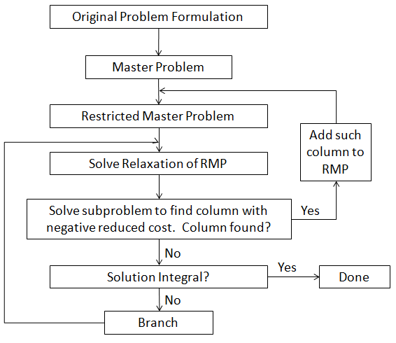

# Branch and Price

[TOC]

Branch and Price是Branch and Bound和Column Generation的结合体，Column Generation处理含有大量变量的复杂（线性）问题，Branch and Bound用来处理整数约束。

## Framework of Branch and Price

### 假如没有初始可行解

加入artificial variables, 使用big M method。

### 假如已加入模型的column显示reduced cost < 0

检查是否为所有的约束都考虑了对偶变量，是否有遗漏的约束

## Transformation from Primal to Dual Problem

 **Primal problem**
$$
\begin{array}{lll}{\min} & {\mathbf{c}^{\prime} \mathbf{x}} & {}\\
{\text {s.t.}} & {\mathbf{a}_{i}^{\prime} \mathbf{x} \geq b_{i},} & {i \in M_{1}} \\
& {\mathbf{a}_{i}^{\prime} \mathbf{x} \leq b_{i},} & {i \in M_{2}} \\
& {\mathbf{a}_{i}^{\prime} \mathbf{x}=b_{i},} & {i \in M_{3}} \\
& {x_{j} \geq 0,} & {j \in N_{1}} \\
& {x_{j} \leq 0,} & {j \in N_{2}} \\
& {x_{j} \text { free, }} & {j \in N_{3}}\end{array}
$$

**Dual problem**
$$
\begin{array}{lll}{\max} & {\mathbf{p}^{\prime} \mathbf{b}} & {} \\
{\text {s.t.}} & {p_{i} \geq 0,} & {i \in M_{1}} \\ {} & {p_{i} \leq 0,} & {i \in M_{2}} \\
{} & {p_{i} \text { free, }} & {i \in M_{3}} \\
{} & {\mathbf{p}^{\prime} \mathbf{A}_{j}}  {\leq c_{j},} & {j \in N_{1}} \\ 
{} & {\mathbf{p}^{\prime} \mathbf{A}_{j}}  {\geq c_{j},} & {j \in N_{2}} \\ 
{} & {\mathbf{p}^{\prime} \mathbf{A}_{j}}  {=c_{j},} & {j \in N_{3}}\end{array}
$$

## Optimality condition

For a minimization problem $c'x$  in standard form, a basis matrix $B$ is said to be **optimal** if:

1. (feasibility condition: x $\geq$ 0)
   
    $B^{-1} b \geq 0$
2. (optimality condition: reduced cost $\geq$ 0)

    $\hat{c_j}' = c'_j - c'_BB^{-1}A_j \geq 0, \forall j$

## Duality theorem

### Weak duality 

> If $\mathbf{x}$ is feasible solution to the primal (minimization) problem, and $\mathbf{p}$ is a feasible solution to dual (maximization) problem, then

$$
\mathbf{p'b} \leq \mathbf{c'x}
$$

**Corollary**

> Let $\mathbf{x}$ and $\mathbf{p}$ be feasible solutions to the primal and the dual respectively, and suppose that $\mathbf{p'b} = \mathbf{c'x}$. Then $\mathbf{x}$ and $\mathbf{p}$ are optimal solutions to the primal and the dual respectively.

### Strong duality

> If a LP programming has an optimal solution, so does its dual, and the respective optimal costs are equal.