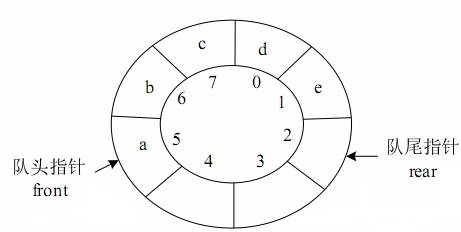

# 数据结构

## 数组

[Segmentfault](https://segmentfault.com/a/1190000016064569)

| 操作                           | 复杂度                     |
| ------------------------------ | -------------------------- |
| 增 -- add(index, E)            | O(n)                       |
| 删 -- remove(index), remove(E) | O(n)                       |
| 改 -- set(index, E)            | 已知索引O(1)；未知索引O(n) |
| 查 -- get(index), contains(E)  | 已知索引O(1)；未知索引O(n) |

> `addLast()` -- O(1) 
>
> `removeLast()` -- O(1) 

Java中提供了ArrayList，底层是数组。

## 栈

[Segmentfault](https://segmentfault.com/a/1190000016067831)

将数组的**最后一个元素**作为**栈顶**，满足LIFO。

| 方法 | 复杂度 |
| ---- | -------------------------- |
|push |	O(1) 均摊|
|pop  |	O(1) 均摊|
|peek |	O(1)|

> `push` -- 等同于 `addLast()`
>
> `pop` -- 等同于 `remveLast()`
>
> `peek` -- 等同于 `getLast()`

## 队列

[Segment](https://segmentfault.com/a/1190000016147024)

在队尾添加元素，从队头取出元素，将数组的最后一个元素作为队尾，第一个元素作为队头，满足FIFO。

| 方法    | 复杂度    |
| ------- | --------- |
| enqueue | O(1) 均摊 |
| dequeue | O(n)      |
| front   | O(1)      |

> `enqueue` -- 等同于 `addLast()`
>
> `dequeue` -- 等同于 `removeFirst()`
>
> `front` -- 等同于 `getFirst()`

### 循环队列

> 队列长度：Q.rear-Q.front；
>
> 队头元素：Q.data[Q.front]；
>
> 队尾元素：Q.data[Q.rear-1]；

| 方法    | 复杂度    |
| ------- | --------- |
| enqueue | O(1) 均摊 |
| dequeue | O(1) 均摊 |
| front   | O(1)      |

## 链表

| 操作                           | 复杂度 |
| ------------------------------ | ------ |
| 增 -- add(index, E)            | O(n)   |
| 删 -- remove(index), remove(E) | O(n)   |
| 改 -- set(index, E)            | O(n)   |
| 查 -- get(index), contains(E)  | O(n)   |

> `addFirst()` -- O(1)
>
> `removeFirst()` -- O(1)

Java中提供了LinkedList，是通过双链表实现的。

## 二分搜索树

[Segmentfault](https://segmentfault.com/a/1190000016501716)

> 二分搜索数是二叉树
>
> 具有递归结构
>
> 元素不相同
>
> 用链表实现二分搜索树

增删改查的时间复杂度取决于树的深度。如果二分搜索树是平衡的，增删改查的时间复杂度为O(logn)，如果二分搜索树完全不平衡，退化为顺序查找，增删改查的时间复杂度为O(n)。因此，为了获得较好的查找性能，就要构造一棵平衡的二叉排序树。

[博客园](https://www.cnblogs.com/geektcp/p/11526925.html)

| 操作 | 二叉查找树 -- 最坏情况：完全不平衡 | 平衡二叉树 | 红黑树  |
| :--- | :--------------------------------- | :--------- | :------ |
| 查找 | O(n)                               | O(logn)    | Olog(n) |
| 插入 | O(n)                               | O(logn)    | Olog(n) |
| 删除 | O(n)                               | O(logn)    | Olog(n) |

## 集合和映射

[Segmentfault](https://segmentfault.com/a/1190000016678186)

> 元素不相同

Java中提供HashSet、TreeSet、LinkedHashSet。如果关注性能，使用HashSet，如果要求有序，使用TreeSet，如果要求Set集合中保存了原始的元素插入顺序，使用LinkedHashSet。

对于**HashSet**而言，

| 操作 | 复杂度 |
| ---- | ------ |
| 增   | O(1)   |
| 删   | O(1)   |
| 改   | O(1)   |
| 查   | O(1)   |

## 堆和优先队列

[Segmentfault](https://segmentfault.com/a/1190000016753056)

> 完全二叉树
>
> 用数组实现二叉堆：下标从1开始，比较能体现性质

| 操作                 | 复杂度  |
| -------------------- | ------- |
| 增加元素             | O(logn) |
| 删除最大值（最大堆） | O(logn) |

> 增加 -- 上浮
>
> 删除 -- 下潜