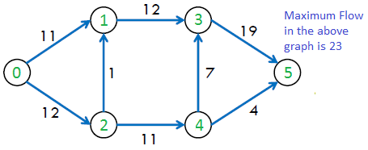

# Minimum Cut Problem, Maximal Flow Problem

[Ford-Fulkerson 最大流算法](https://blog.csdn.net/Mr_KkTian/article/details/53408823)

[最大流网络之Push-Relabel算法](https://blog.csdn.net/Mr_KkTian/article/details/53574134)

## 最大流与最小割




**最大流问题**

如果把有向图$G=(V,A)$看作是水管,每条边上的权重就是能够通过该水管段最高单位流量，那么最大流问题就是求从起点到终点所能达到的最高单位流量。

**最小割问题**

一个割就是一组边的集合，将该集合从图中边集中移除，那么图被分割为两个部分，这两个部分之间没有任何边连接。简单而言，一块肉被从中间隔开，分成两个部分，中间断开的连接的集合就是割。

最小割就是将图切割为两个部分时，代价最小的割的集合，代价就是边上容量的和（S部分到T部分边的容量）。

> 最小割 = 最大流

**通路**：从图起点（S）到达图结束点（T）的路径，由一系列顶点组成；

**通路流量**：该通路上所能达到的最大单位流量；

**饱和边**：容量等于通路流量的有向边。

## 算法

[网络流各类算法简单总结与比较](https://blog.csdn.net/weixin_30916125/article/details/95079072)

### Ford-Fulkerson

适用： 带非负权重的有向图

时间复杂度：$O(maxflow \cdots |A|)$

``` pseudocode
FORD-FULKERSON-METHOD(G, s, t)
  initialize flow f to 0
  while there exists an augmenting path p
    do augment flow f along p
  return f
```

``` java
// solved by Ford-Fulkerson algorithm
public int solve_FordFulkerson(int s, int t){
    int maxFlow = 0;
    int[] path = new int[n_nodes];
    int[][] residual = new int[n_nodes][n_nodes];
    for (int i = 0; i < n_nodes; i++) {
        residual[i] = this.capacity[i].clone();
        path[i] = 0;
    }
    while (findAugmentedPath(residual, path, s, t, 1)) {
        maxFlow += addPathFlow(residual, path, s, t);
    }
    return maxFlow;
}// finds an augment path s-t
private boolean findAugmentedPath(int[][] residual, int[] path, int s, int t, int delta) {
    boolean[] visited = new boolean[n_nodes];
    Arrays.fill(visited, false);
    Queue<Integer> queue = new LinkedList<>();
    queue.offer(s);
    visited[s] = true;
    // BFS
    while (queue.size() > 0) {
        int top = queue.poll();
        for (int i = 0; i < n_nodes; i++) {
            if(!visited[i] && residual[top][i] >= delta) {
                queue.offer(i);
                visited[i] = true;
                path[i] = top;
            }
        }
    }
    return visited[t];
}// adds the flow of augment path
private int addPathFlow(int[][] residual, int[] path, int s, int t) {
    int minFlow = Global.INF;
    for (int v = t; v != s; v = path[v]) {
        int u = path[v];
        minFlow = (minFlow > residual[u][v]) ? residual[u][v] : minFlow;
    }
    for (int v = t; v != s; v = path[v]) {
        int u = path[v];
        residual[u][v] -= minFlow;
        residual[v][u] += minFlow;
    }
    return minFlow;
}
```

### Scaling Ford-Fulkerson

``` pseudocode
// Scaling Ford-Fulkerson algorithm:
Initialize f(e) = 0 for all e.
Let ∆ = C;
while ∆ ≥ 1 do
   while there is an s − t path in Gf(∆) do
      choose an s − t path p;
      f =augment(p, f);
   end while
   ∆ = ∆/2;
end while
return f;
```

``` java
public int solveScalingFordFulkerson(int s, int t, int initDelta){
    int maxFlow = 0;
    int[] path = new int[n_nodes];
    int[][] residual = new int[n_nodes][n_nodes];
    for (int i = 0; i < n_nodes; i++) {
        residual[i] = this.capacity[i].clone();
        path[i] = 0;
    }
    int delta = initDelta;
    while (delta >= 1) {
        while (findAugmentedPath(residual, path, s, t, delta)) {
            maxFlow += addPathFlow(residual, path, s, t);
        }
        delta = delta / 2;
    }
    for (int i = 0; i < n_nodes; i++) {
        System.out.println(Arrays.toString(residual[i]));
    }
    return maxFlow;
}
```

### Push-Relabel

``` java
public int solvePushRelabel(int s, int t) { // s-0, t-n
   reset();
   int[] e = new int[n_nodes];
   int[] h = new int[n_nodes];
   Arrays.fill(e, 0);
   Arrays.fill(h, 0);
   h[s] = n_nodes;
   for (int u = s; u <= t; u++) {
       if (residual[s][u] > 0) {
           e[u] = residual[s][u];
           e[s] -= residual[s][u];
           residual[u][s] = residual[s][u];
           residual[s][u] = 0;
       }
   }   boolean cont = true;
   while(cont) {
       boolean push = false;
       for (int u = s + 1; u < t; u++) {
           if (e[u] > 0) {
               push = true;
               boolean relabel = true;
               for (int v = s; v <= t && e[u] > 0 ; v++) {
                   if (residual[u][v] > 0 && h[u] > h[v]) {
                       relabel = false;
                       int bottleneck = Math.min(residual[u][v], e[u]);
                       e[u] -= bottleneck;
                       e[v] += bottleneck;
                       residual[u][v] -= bottleneck;
                       residual[v][u] += bottleneck;
                   }
               }
               if (relabel) {
                   h[u]++;
               }
           }
       }
       if (!push) {
           maxFlow = e[t];
           cont = false;
       }
   }
   return maxFlow;
}
```