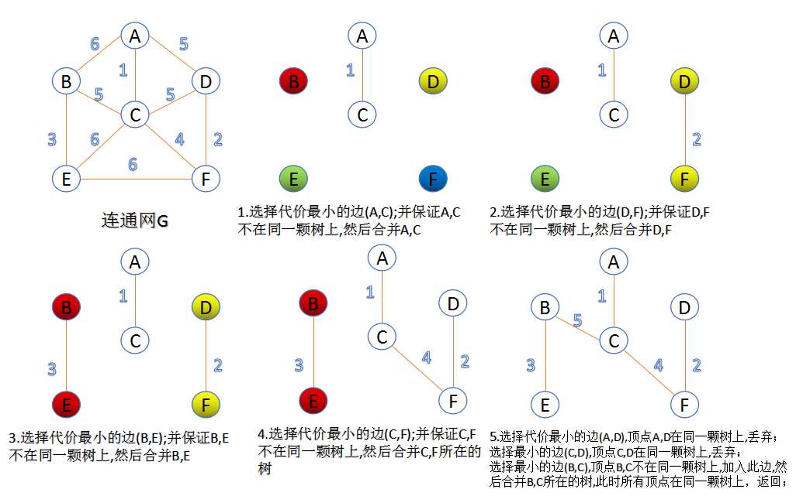

# Minimum Spanning Tree

**Spanning Tree**
   
A tree contains all the vertices of a graph $G$ is called the *spanning tree* of graph $G$.


**Minimal Spanning Tree**

The spanning tree with least total edge weight over such tree.


## [最小生成树的两种方法](https://blog.csdn.net/a2392008643/article/details/81781766)

1. Kruskal算法
   
   此算法可以称为“**加边法**”，初始最小生成树边数为0，每迭代一次就选择一条满足条件的最小代价边，加入到最小生成树的边集合里。 
   ```
   1. 把图中的所有边按代价从小到大排序； 
   2. 把图中的n个顶点看成独立的n棵树组成的森林； 
   3. 按权值从小到大选择边，所选的边连接的两个顶点$u_i$,$v_i$应属于两颗不同的树，则成为最小生成树的一条边，并将这两颗树合并作为一颗树。 
   4. 重复(3),直到所有顶点都在一颗树内或者有n-1条边为止。
   ```
   
2. Prim算法
   
   此算法可以称为“**加点法**”，每次迭代选择代价最小的边对应的点，加入到最小生成树中。算法从某一个顶点s开始，逐渐长大覆盖整个连通网的所有顶点。
   ```
   1. 图的所有顶点集合为V；初始令集合u={s},v=V−u;
   2. 在两个集合u,v能够组成的边中，选择一条代价最小的边(u0,v0)，加入到最小生成树中，并把v0并入到集合u中。
   3. 重复上述步骤，直到最小生成树有n-1条边或者n个顶点为止。
   ```

   由于不断向集合u中加点，所以最小代价边必须同步更新；需要建立一个辅助数组closedge,用来维护集合v中每个顶点与集合u中最小代价边信息。

   

   
   