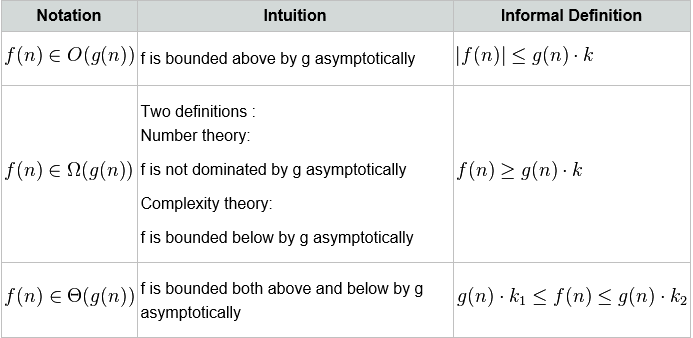
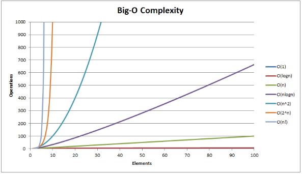
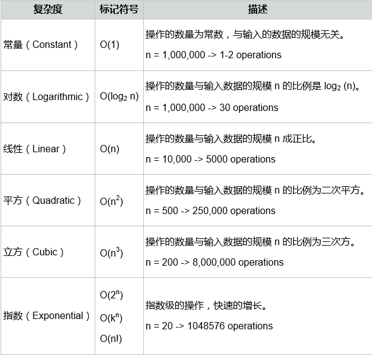

# 算法复杂度

## 渐进记号

通常有O, Θ, Ω记号法。Θ记号渐进地给出了一个函数的上界和下界，当只有渐进上界时使用O记号，当只有渐进下界时使用Ω记号。

## 时间复杂度

常用的时间复杂度所耗费的时间从小到大依次是：

$O(1) < O(log_n) < (n) < O(nlog_n) < O(n^2) < O(n^3) < O(2^n) < O(n!) < O(n^n)$

