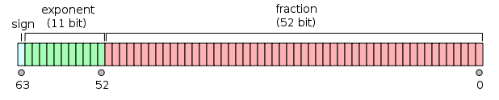

# C++入门学习

[RUNOOB.COM: C++教程](https://www.runoob.com/cplusplus/cpp-intro.html)

## C++简介

1. C++是**中级**语言。
2. C++是**面向对象**的程序设计语言。面向对象开发的四大特性：封装、抽象、继承、多态。
3. C++的源文件扩展名默认为`.cpp`。

## C++环境配置

1. [安装 GNU 的 C/C++ 编译器](https://www.runoob.com/cplusplus/cpp-environment-setup.html)
2. [使用 Visual Studio编译](https://www.runoob.com/cplusplus/cpp-environment-setup.html)

## C++基本语法

对象、类、方法、即时变量。对象具有状态和行为，对象是类的实例。

### C++程序结构

```c++
#include <iostream> // 1. 引入头文件 <iostrem>
using namespace std; // 2. 使用命名空间std

int main() // 3. main()是程序开始执行的地方
{
	cout << "Hello world"; // 4. 输出``Hello world``到屏幕
	return 0; // 5. 终止main()函数，返回值0
}
```

### C++数据类型

#### 基本数据类型

| 类型     | 关键字  | 位                |
| :------- | :------ | ----------------- |
| 布尔型   | bool    | **1** 或 4 个字节 |
| 字符型   | char    | 1 个字节          |
| 整型     | int     | 4 个字节          |
| 浮点型   | float   | 4 个字节          |
| 双浮点型 | double  | 8 个字节          |
| 无类型   | void    |                   |
| 宽字符型 | wchar_t | 2 或 4 个字节     |

1. 一个字节（byte）为8位（bit）。
2. 一些基本类型可以使用一个或多个类型修饰符进行修饰：`signed`, `unsigned`, `short`, `long`。
3. 各种数据类型的大小会根据编译器和所使用的电脑而有所不同。

#### 派生数据类型

**枚举类型**（enumeration)

```c++
enum color {red, green, blue} c; // enum 枚举名{标识符[=整型常数],标识符[=整型常数]} 枚举变量
```

```c++
enum color {red, green, blue};
enum color c = red; // 这种声明方式也ok
cout << c << endl; // 输出"0" -- 枚举元素的值默认从0开始，逐个+1，red是标识符，其值为0
cout << (c == 0) << endl; // 输出"1" -- 值ok
cout << (c == red) << endl; // 输出"1" -- 标志符ok
```

### C++变量类型

| 类型   | 描述                                                         |
| :----- | :----------------------------------------------------------- |
| float  | 单精度浮点值。单精度是这样的格式，1位符号，8位指数，23位小数。 |
| double | 双精度浮点值。双精度是1位符号，11位指数，52位小数。 |

#### 声明和定义

```c++
#include <iostream>
using namespace std;

extern int a, b; // 变量声明
int func();//函数声明

int main()
{	
    int a, b; // 变量定义
    a = 10; // 变量初始化
    b = 20; // 变量初始化
	cout << func(a, b) << endl; // 函数调用
	return 0;
}

//函数定义
int func(a, b)
{
    return a + b;
}
```

1. 声明和变量都规定了变量和名字和类型，声明不会分配内存，定义会分配内存。
2. 同一个变量的声明可以有多处，定义只有一处。**extern**关键字表明这个变量定义在其他文件。
3. C/C++ 编译 cpp 文件是从上往下编译，所以 main 函数里面调用其他函数时，如果其他函数在 main 函数的下面，则要在 main 函数上面先声明这个函数，或者把 main 函数放在最下面。这个不仅限于 main 函数，其他函数的调用都是如此。被调用的函数要在调用的函数之前声明。

#### 变量类型转换

1. 自动转换规则：

   - 若参与运算量的类型不同，则先转换成同一类型，然后进行运算。
   - 转换按数据长度增加的方向进行，以保证精度不降低。如int型和long型运算时，先把int量转成long型后再进行运算。   a、若两种类型的字节数不同，转换成字节数高的类型   b、若两种类型的字节数相同，且一种有符号，一种无符号，则转换成无符号类型
   -  所有的浮点运算都是以双精度进行的，即使仅含float单精度量运算的表达式，也要先转换成double型，再作运算。
   -  char型和short型参与运算时，必须先转换成int型。
   -  在赋值运算中，赋值号两边量的数据类型不同时，赋值号右边量的类型将转换为左边量的类型。
   
2. 强制转化规则

   一般形式为：(类型说明符)(表达式)，其功能是把<u>表达式的运算结果强制</u>转换成类型说明符所表示的类型，并没有改变变量。

   ```c++
   double b = 2.1;
   cout << (int)b << endl; // 输出 2
   cout << b << endl; // 输出 2.1
   ```

#### 变量作用域

局部变量和全局变量

```c++
#include <iostream>
using namespace std;

int g; // 全局变量

int main ()
{
  int a, b; // 局部变量
  a = 10;
  b = 20;
  g = a + b;
 
  cout << g << endl;
  return 0;
}
```

1. 局部变量和全局变量的名称可以相同，但是局部变量与全局变量是两个独立的变量，互不影响。

2. 全局变量和static局部变量的区别：全局变量和static局部变量的生存期均为程序的整个生命周期，static局部变量的作用域和一般的局部变量相同，只能在定义该变量的代码块内使用，退出该代码块后，尽管该变量继续存在，但是不能使用它。

3. 当定义局部变量时，系统不会对其初始化，您必须自行对其初始化。定义全局变量时，系统会自动对其初始化。

   | 数据类型 | 初始化默认值  |
   | :------- | :------------ |
   | int      | 0             |
   | char     | '\0'          |
   | float    | 0             |
   | double   | 0             |
   | bool     | 0  or `false` |
   | pointer  | NULL          |

### C++常量

常量就像是常规的变量，只不过常量的值在定义后不能进行修改。

#### 整数

```c++
212 // 十进制
0213 // 八进制 0
0x4b // 十六进制 0x
215U // 无符号 u
20L // 长整数 L
```

#### 浮点数

```c++
3.14159 // 小数形式
314159E-5    // 指数形式
3.14159F // float类型 F
```

#### 字符

```c++
`x` // 普通字符
L`x` // 宽字符
`\n` // 转义字符
```

#### 字符串

```c++
"hello dear"
```

#### #define 与 const

```c++
#include <iostream>
using namespace std;
 
#define LENGTH 10 // #define 只是字符替换

int main()
{
   const int WIDTH  = 5; // const 定义变量时必须初始化
   return 0;
}
```

`#define`与`const`区别很大，`#define`宏定义是<u>字符替换</u>，不会分配内存，`const`修饰<u>变量</u>表明该变量不可以修改，会分配内存。 [RUNOOB](https://www.runoob.com/cplusplus/cpp-constants-literals.html)

```c++
const int a = 10;
int const a = 10; // 和上一行等同
char * const p; // 修饰指针，指针不能修改
char const * p; // 修饰char，char值不能修改
char const * const p; // 修饰指针和char，指针和char值都不能修改
```

**const**修饰变量意味着该变量不能被修改。<u>const在谁后面谁就不可以修改，const在最前面则将其后移一位，二者等效</u>。 [RUNOOB](https://www.runoob.com/cplusplus/cpp-constants-literals.html)

### C++存储类

1. static修饰局部变量，局部变量在程序的生命周期内都存在，可以保持局部变量的值，但是只能在定义该变量的代码块内使用。static 修饰全局变量，全局变量只能在定义该变量的文件内使用。
2. extern 通常用于多个文件共享相同的全局变量或函数时，extern表示声明的全局变量或函数定义在另一个文件中。
3. mutable 仅适用于类的对象，允许对象的成员替代常量。
4. thread_local 修饰变量表明声明的变量仅可在它在其上创建的线程上访问

**static 修饰类的成员变量**

- 静态成员变量是先于类的对象而存在

- 这个类的所有对象共用一个静态成员
- 如果静态成员是公有的，那么可以直接通过类名调用
- 静态成员数据在声明时候类外初始化

**static 修饰类的成员方法**

- 静态成员函数是先于类的对象而存在
- 可用类名直接调用（公有）
- 在静态成员函数中没有this指针，所以不能使用非静态成员

### C++运算符

#### 逻辑运算符

1. && 会先判断左边是否为真，如果为假，不会再计算右值。 || 会先判断左边是否为真，如果为真，不会再计算右值。

#### 位运算符

| 运算符 | 描述                                 | 实例                                       |
| :----- | :----------------------------------- | :----------------------------------------- |
| &      | 二进制 AND 运算符                    | 1 & 1 = 1，1 & 0 = 0，0 & 1 = 0，0 & 0 = 0 |
| \|     | 二进制 OR 运算符                     | 1 & 1 = 1，1 & 0 = 1，0 & 1 = 1，0 & 0 = 0 |
| ^      | 二进制异或运算符                     | 1 & 1 = 0，1 & 0 = 1，0 & 1 = 1，0 & 0 = 0 |
| ~      | 二进制补码运算符                     | ~1 = 0，~0 = 1                             |
| <<     | 二进制左移运算符。向左移动指定位数。 | 0000 1100 << 2 = 0000 0011                 |
| >>     | 二进制右移运算符。向右移动指定位数。 | 0000 1100 >> 2 = 0011 0000                 |

#### 杂项运算符

| 运算符            | 描述                                                      |
| :---------------- | :-------------------------------------------------------- |
| sizeof            | sizeof运算符 返回变量的字节大小。                         |
| Condition ? X : Y | 条件运算符。如果 Condition 为真 ? 则值为 X : 否则值为 Y。 |
| . 和 ->           | 成员运算符 用于引用类、结构和共用体的成员。               |
| &                 | 指针运算符 & 返回变量的地址。                             |
| *                 | 指针运算符 * 返回地址指向的变量的值。                     |

### C++函数

```c++
#include <iostream>
using namespace std;
 
int max(int num1, int num2); // 函数声明
 
int main ()
{
   int a = 100;
   int b = 200;
   int ret;

   ret = max(a, b); // 调用函数
   cout << "Max value is : " << ret << endl; 
   return 0;
}
 
int max(int num1, int num2) // 函数定义，形式参数
{
   int result;
   
   if (num1 > num2)
      result = num1;
   else
      result = num2;
   return result; 
}
```

1. `int max(int, int);`也是有效的函数声明。

2. 形式参数就像函数内的局部变量，在进入函数时被创建，退出函数时被销毁。

3. 向函数传递参数的方式
   - 传值调用：把参数的实际<u>值</u>复制给函数的形式参数。修改函数内的形式参数不会影响实际参数。
   
     ```c++
     void swap(int x, int y); // 函数声明
     
     int main()
     {
        int a = 100;
        int b = 200;
        swap(a, b); // 函数调用 -- a = 100, b = 200
     }
     
     void swap(int x, int y) // 函数定义
     {
        int temp;
        temp = x; 
        x = y;    
        y = temp; 
        return;
     }
     ```
   
   - 指针调用：把参数的<u>地址</u>复制给形式参数。修改形式参数会影响实际参数。
   
     ```c++
     void swap(int * x, int * y); // 函数声明
     
     int main()
     {
        int a = 100;
        int b = 200;
        swap(&a, &b); // 函数调用 -- a = 200, b = 100
     }
     
     void swap(int * x, int * y) // 函数定义
     {
        int temp;
        temp = *x;   
        *x = *y;     
        *y = temp;   
        return;
     }
     ```
   
   - 引用调用：把引用的<u>地址</u>复制给形式参数。修改形式参数会影响实际参数。
   
     ```c++
     void swap(int & x, int & y); // 函数声明
     
     int main()
     {
        int a = 100;
        int b = 200;
        swap(a, b); // 函数调用 -- a = 200, b = 100
     }
     
     void swap(int & x, int & y) // 函数定义
     {
        int temp;
        temp = x; 
        x = y;   
        y = temp; 
        return;
     }
     ```
   

#### Lambda 函数/表达式

匿名函数

```c++
[](int x, int y) -> int { int z = x + y; return z + x; }
```

### C++字符串

1. C 风格的字符串实际上是使用 <u>**null** 字符 '\0'</u> 终止的一维字符数组。

   ```c++
   char greeting[] = "Hello"; // strlen = 5 -- 实际大小，sizeof(greeting) = 6 -- 字节数
   ```

   

2. C++ 标准库提供了 **string** 类类型，提供了一系列针对字符串的操作。

### C++数组

1. 数组名是指向数组中第一个元素的<u>常量指针</u>，即第一个元素的<u>地址</u>： `array = &array[0]`

   ```c++
   int arr[] = {1, 2, 3, 4};
   cout << arr << endl; // 输出 0x7fff9a12d660
   cout << *arr << endl; // 输出 1
   ```

2. 利用指针访问数组元素

   ```c++
   int arr[] = {1, 2, 3, 4};
   for ( int i = 0; i < 4; i++ )
   {
   	cout << *(arr + i) << endl; // arr 为常量
   }
   
   int * p = arr;
   for ( int i = 0; i < 4; i++ )
   {
   	cout << *p << endl; 
   	p++; // p 为变量
   }
   ```

3. C/C++规定对于**char**型数组，直接输出首地址时，会输出数组内容。如果想得到地址，可采用`&name`。

   ```c++
   char name[] = {"Zara Ali"};
   cout << name << endl; // 输出 Zara Ali
   cout << &name << endl; // 输出 0x7fffebd65147 
   ```

4. C++不允许返回一个完整的数组，但是可以通过指针实现返回数组。

   ```c++
   #include <iostream>
   #include <cstdlib>
   #include <ctime>
    
   using namespace std;
    
   int * getRandom( )
   {
     static int r[10]; // 不能返回局部变量，除非为static
    
     srand( (unsigned)time( NULL ) ); // 设置random seed
     for (int i = 0; i < 10; ++i)
     {
       r[i] = rand();
     }
     return r;
   }
    
   int main ()
   {
      int *p;
    
      p = getRandom();
      for ( int i = 0; i < 10; i++ )
      {
          cout << *(p + i) << endl;
      }
    
      return 0;
   }
   ```

### C++指针

```c++
int main ()
{
   int var = 20;   
   int * ip;        // 声明了指向int的指针变量, * 为类型标识符
   // int *ip; ok
 
   ip = &var;       // & 访问var的地址
    
   // 输出在指针变量中存储的地址
   cout << "Address stored in ip variable: "; 
   cout << ip << endl; // 0xbfc601ac
 
   // 访问指针中地址的值
   cout << "Value of *ip variable: ";
   cout << *ip << endl; // * 访问指针所指向的变量的值 20， * 为指针运算符
 
   return 0;
}
```

1. 指针是一个整型变量，其值为另一个变量的<u>地址</u>，表示为一个十六进制的整数。

2. 指针运算符：`&` + 变量 -- 访问变量的地址， `* ` + 指针 -- 指针指向的变量的值

3. 对于没有初值的指针变量赋值NULL， 避免指针未初始化。

   ```c++
   int * ptr = NULL; 
   ```
   
   NULL 指针是一个定义在标准库中的值为 0 的常量。
   
   ```   c++
   #define NULL 0 
   ```
   
4. 指针是一个整型变量，可以进行算术运算。

   ```c++
   int i = 0;
   int * p = &i ; // 0x7ffce4b7c8b4
   p++; // 指向下一个整数位置，32位系统中占4个字节，0x7ffce4b7c8b8
   ```
   
5. 指向数组和指向元素的区别 [RUBOOB](https://www.runoob.com/cplusplus/cpp-pointer-arithmetic.html)

   ```       c++
   int var[5] = {1,2,3,4,5};
   int * ip;
   
   ip = var; // var == &var[0]，所以*var始终指的是第一个元素的值
   ip = &var[0];
   ```

6. 区分指针<u>标识符</u>`*`与指针运算符`*`

   ```c++
   int i = 10;
   int * p = &i;
   cout << *p << endl; // 输出 10
   ```

7. 用指向字符的指针数组来存储字符串列表

   ```c++
   #include <iostream>
    
   using namespace std;
   const int MAX = 4;
    
   int main ()
   {
      const char * names[MAX] = {"Zara Ali", "Hina Ali", "Nuha Ali", "Sara Ali"};
   
      for (int i = 0; i < MAX; i++)
      {
         cout << names[i] << ", "; // 输出 Zara Ali, Hina Ali, Nuha Ali, Sara Ali, 
      }
      return 0;
   }
   ```

   🙋‍`char * names[]`可以理解为二维数组。

   ```c++
   name[i] -- 访问第i行的元素
   *(name[i] + j) -- 访问第i行第j列的元素
   ```

8. 多级间接寻址：指向指针的指针

   ```c++
   int  var;
   int  * ptr;
   int  ** pptr;
   
   var = 3000;
   ptr = &var;
   pptr = &ptr;
   
   cout << var << endl; // 输出 3000
   cout << *ptr << endl; // 输出 3000
   cout << **pptr << endl; // 输出 3000
   ```

9. C++允许把指针作为函数参数，也允许把指针作为函数返回值。能接受指针传参的函数，也能接受数组传参。

### C++引用

1. 引用变量是一个<u>别名</u>。// 类似于`typedef`，作用对象不同

   ```c++
   int i = 17;
   int & r = i;
   ```

2. 把引用作为参数，比传值调用效率更高，不会在内存中生成形参的副本。

   ```c++
   void swap(int &x, int &y) 
   {
      int temp;
      temp = x; 
      x = y;   
      y = temp; 
      return;
   }
   
   int main()
   {
      int a = 100;
      int b = 200;
      swap(a, b); // a = 200, b = 100
   }
   ```

3. 把引用作为返回值，函数就可以放在赋值语句的左边，也不会在内存中产生返回值的副本。

   ```c++
   double& setValues( int i )
   {
     return vals[i];   // 返回第 i 个元素的引用 -- 别名
   }
   
   int main()
   {
   	double vals[] = {10.1, 12.6, 33.1, 24.1, 50.0};
   	setValues(1) = 20.23;
   }
   ```

4. 区分引用<u>标识符</u>`&`与指针<u>运算符</u>`&`

   ```c++
   int i = 10;
   int & r = i;
   int * p = &i;
   cout << *p << endl; // 10
   cout << r << endl; // 10
   ```

### C++日期与时间

1. 四个与时间相关的类型：`clock_t`, `time_t`, `size_t`, `tm`。

2. 获取当前日期与时间

   ```c++
   #include <iostream>
   #include <ctime> // 导入头文件
   
   using namespace std;
   
   int main()
   {
      time_t now = time(NULL); // 返回自1970-01-01 00:00:00起经过的时间(s)
      cout << ctime(&now) << endl; // 输出 Wed Dec 16 02:59:35 2020
      return 0;
   }
   ```

### C++基本的输入输出

```c++
#include <iostream> // 导入头文件
#include <iomanip> // 导入头文件

using namespace std;

int main()
{
    char name[20];
    cout << "input your name: " << endl; // 标准输出流
    cin >> name; // 标准输入流
    
    char err[] = "Unable to read";
    cerr << "Error message: " + err << end; // 标准错误流
    clog << "Error message : " << str << endl; // 标准日志流
    
    cout.precision(5);       // 设置有效数字长度    
    cout.setf(ios::right); // 左对齐  
    cout.width(10);          // 设置显示域宽10 
    cout.fill('*');          // 在显示区域空白处用*填充
    cout<<123.456789<<endl;
    
    return 0;
}
```

### C++结构体

```c++
#include <iostream>
#include <cstring>
 
using namespace std;
 
// 声明结构体类型 Book
struct Book
{
   char  title[50];
   char  author[50];
   char  subject[100];
   int   book_id;
};

void printBook(struct Book book);
void printBook(struct Book * book);
 
int main( )
{
   Book book1;        // 定义结构体类型 Book 的变量 book1
 
   // 访问结构体成员
   strcpy( book1.title, "C++ 教程");
   strcpy( book1.author, "Runoob"); 
   strcpy( book1.subject, "编程语言");
   book1.book_id = 12345;
 
   printBook(book1);
   printBook(&book1);
 
   return 0;
}

void printBook(struct Book book) // 结构体作为函数参数
{
   cout << "书标题 : " << book.title <<endl;
   cout << "书作者 : " << book.author <<endl;
   cout << "书类目 : " << book.subject <<endl;
   cout << "书 ID : " << book.book_id <<endl;
}

void printBook(struct Book * book) // 指向结构体的指针作为函数参数
{
   cout << "书标题  : " << book->title <<endl;
   cout << "书作者 : " << book->author <<endl;
   cout << "书类目 : " << book->subject <<endl;
   cout << "书 ID : " << book->book_id <<endl;
}
```

## C++面向对象

### C++类与对象

```c++
#include <iostream>
 
using namespace std;
 
class Box
{
   public:
      double length;  
      double breadth; 
      double height;  
    	
      double getVolume(void); 
      Box(double, double, double); // 构造函数
      ~Box(); // 析造函数 -- 不需要显示调用
};

Box::Box(double len, double bre, double hei) // 定义构造函数
{
    length = len;
    breadth = bre;
    height = hei;
}

Box::~Box(void)
{
    cout << "Object is being deleted" << endl;
}

double Box::getVolume(void) // :: 定义成员函数
{
    return length * breadth * height;
}
 
int main( )
{
   Box box1(5.0, 6.0 ,7.0); // 每次创建新对象时 调用构造函数      
   double volume = box1.getVolume(); 
   cout << "Box1 的体积：" << volume <<endl;
   
   return 0;
}
```

1. 类和成员的默认访问修饰符是 private。
2. 构造函数和析造函数属于成员函数，友元函数不属于成员函数。

#### 构造函数

1. 每次创建新对象时调用构造函数。构造函数可用于创建对象赋初始值。

2. 使用初始化列表来初始化字段。

   ```c++
   Box::Box(double len, double bre, double hei): length(len), breadth(bre), height(hei) {} // 保持与声明时顺序一致
   ```

3. 一个类可以具有多个构造函数，如果用户没有定义，编译器会生成一个默认的无参的构造函数。

##### 拷贝构造函数

```c++
#include <iostream>
 
using namespace std;
 
class Line
{
   public:
      int getLength(void);
      Line(int len);      // 构造函数
      Line(const Line & obj);  // 拷贝构造函数
      ~Line();  // 析构函数
 
   private:
      int * ptr;
};
 
Line::Line(int len)
{
    cout << "调用构造函数" << endl;
    ptr = new int; // 为指针分配内存
    *ptr = len;
}
 
Line::Line(const Line & obj) // obj 是一个对象引用
{
    cout << "调用拷贝构造函数" << endl;
    ptr = new int;
    *ptr = *obj.ptr; 
}
 
Line::~Line(void)
{
    cout << "释放内存" << endl;
    delete ptr;
}
int Line::getLength( void )
{
    return *ptr;
}
 
void display(Line obj)
{
   cout << "line：" << obj.getLength() <<endl;
}
 
int main( )
{
   Line line(10); // 调用构造函数
 
   display(line); // ①调用拷贝构造函数生成形参，②析造掉形参
 
   return 0; // 析造掉line
}
```

1. 如果用户没有定义，编译器会生成一个默认的拷贝构造函数。

2. 拷贝构造函数的调用时机：

   - 对象以值传递的方式传入函数参数 [RUNOOB](https://www.runoob.com/cplusplus/cpp-copy-constructor.html)

     ```c++
     void display(Line obj) // Line 是类
     {
        cout << "line 大小 : " << obj.getLength() <<endl;
     }
     
     int main( )
     {
        Line line(10); 
        display(line); // 存在复制
      
        return 0; 
     }
     ```

   - 对象以值传递的方式从函数返回 [CSDN](https://blog.csdn.net/u011361880/article/details/77109698)

     ```c++
     Line fun()
     {
     	Line line(10);
     	return line; // 存在复制
     }
     
     int main()
     {
     	fun();
     	return 0;
     }
     ```

   - 对象需要通过另一个对象进行初始化

     ```
     Line line(10);
     Line line2 = line;
     ```

3. 如果类带有指针变量，并有动态内存分配，则它必须有一个拷贝构造函数。

4. 为指针分配内存

   ```c++
   // 正确写法
   Line::Line(int len)
   {
       ptr = new int; // 堆中的内存空间在整个程序运行期间一直可用，直到用delete释放它。
       *ptr = len;
   }
   // 典型错误写法
   Line::Line(int len)
   {
       ptr = &len; // 形参属于函数中局部变量，生命周期仅限于函数内。
   }
   ```

#### 析造函数

1. 每次删除对象时调用析造函数。析构函数有助于在程序结束时释放资源。
2. 一个类只有一个析造函数，如果用户没有定义，编译器会生成一个默认的析造函数。

#### 友元函数

```c++
class Box
{
      double width; // 默认 private
   public:
      friend void printWidth(Box box);
};
 
// 友元函数
void printWidth(Box box)
{
   cout << "Width of box : " << box.width <<endl;
}
```

1. `friend` 友元函数有权访问类的所有private成员和protected成员。

#### 静态成员

1. 静态成员在函数外部定义。

    ```c++
   class Box
   {
   	static int count;
   }
   
   int Box::count = 0;
   
   int main() 
   {
       // 函数体
   }   
   ```

### C++继承

```c++
// 基类
class Animal {
    // eat() 函数
    // sleep() 函数
};

// 派生类
class Dog : public Animal {
    // bark() 函数
};
```

1. 类可以**多继承**

   ```c++
   // 基类
   class Shape { ... };
   class PaintCost { ... };
   // 派生类
   class Rectangle: public Shape, public PaintCost { ... }; // 默认 private，通常使用 public
   ```

2. 类的成员的访问权限

   | 访问     | public | protected | private |
   | :------- | :----- | :-------- | :------ |
   | 同一个类 | yes    | yes       | yes     |
   | 派生类   | yes    | yes       | no      |
   | 外部的类 | yes    | no        | no      |

3. 继承方式

    | 继承方式      | 基类的public成员  | 基类的protected成员 | 基类的private成员 |
    | :------------ | :---------------- | :------------------ | :---------------- |
    | public继承    | 仍为public成员    | 仍为protected成员   | 不可见            |
    | protected继承 | 变为protected成员 | 变为protected成员   | 不可见            |
    | private继承   | 变为private成员   | 变为private成员     | 不可见            |

### C++重载 (overload)

#### 函数重载

```c++
class printData
{
   public:
      void print(int);
      void print(double);	
};
```

#### 运算符重载

```c++
#include <iostream>

using namespace std;

class Distance
{
   private:
      int feet;     
      int inches;   
   public:
      Distance();
      Distance(int, int);
      void displayDistance();
      Distance operator-(); 
      Distance operator+(const Distance &); 
      bool operator<(const Distance &);
};

Distance::Distance()
{
   feet = 0;
   inches = 0;
}

Distance::Distance(int f, int i)
{
   feet = f;
   inches = i;
}

void Distance::displayDistance()
{
   cout << feet << "，" << inches <<endl;
}

// 重载一元运算符 -
Distance Distance::operator- ()  
{
    feet = -feet;
    inches = -inches;
    return Distance(feet, inches);
}

// 重载二元运算符 +
Distance Distance::operator+(const Distance & b)
{
    Distance d;
    d.feet = this->feet + b.feet;
    d.inches = this->inches + b.inches;
    return d;
}

// 重载小于运算符
bool Distance::operator <(const Distance & d)
{
    if(feet < d.feet)
    {
        return true;
    }
    if(feet == d.feet && inches < d.inches)
    {
        return true;
    }
    return false;
}

int main()
{
   Distance D1(11, 10);
 
   -D1;                   
   D1.displayDistance();    // 输出 -11, -10
 	
   Distance D2 = D1 + D1;
   D2.displayDistance();    // 输出 -22, -20
    
   cout << (D1 < D2) << endl; // 输出 0
 
   return 0;
}
```

### C++多态

C++ 多态与 java 重写类似。

```c++
#include <iostream> 
using namespace std;
 
class Shape {
   protected:
      int width, height;
   public:
      Shape(int a=0, int b=0) 
      {
         width = a;
         height = b;
      }
      virtual int area() // 虚函数
      {
         cout << "Parent class area" <<endl;
         return 0;
      }
};

class Rectangle: public Shape{
   public:
      Rectangle(int a=0, int b=0):Shape(a, b) {}
      int area ()
      { 
         cout << "Rectangle class area" <<endl;
         return (width * height); 
      }
};

class Triangle: public Shape{
   public:
      Triangle(int a=0, int b=0):Shape(a, b) {}
      int area ()
      { 
         cout << "Triangle class area" <<endl;
         return (width * height / 2); 
      }
};

int main( )
{
   Shape * shape;
   Rectangle rec(10,7);
   Triangle  tri(10,5);
 
   shape = &rec;
   shape->area(); // Rectangle class area
 
   shape = &tri;
   shape->area(); // Triangle class area
   
   return 0;
}
```

1. `virtual `虚函数 [CSDN](https://blog.csdn.net/hackbuteer1/article/details/7558868)

   ① 派生类中重新定义基类中定义的虚函数时，会告诉编译器不要静态链接到该函数。定义为虚函数，是为了允许基类的指针调用派生类的该函数。

   ```c++
   virtual int area() // 虚函数
   {
      cout << "Parent class area" <<endl;
      return 0;
   }
   ```

2. 纯虚函数

   ① 包含纯虚函数的类是抽象类，不能被实例化，只能被继承。

   ② 派生类中必须重写纯虚函数。

   ```c++
   virtual int area() = 0; // 纯虚函数
   ```

### C++接口与抽象类

包含纯虚函数的类是抽象类，不能被实例化，只能被继承。

## C++高级教程

### C++文件和流

```c++
void open(const char *filename, ios::openmode mode);
```

| 模式标志   | 描述                                                         |
| :--------- | :----------------------------------------------------------- |
| ios::app   | 追加模式。所有写入都追加到文件末尾。                         |
| ios::ate   | 文件打开后定位到文件末尾。                                   |
| ios::in    | 打开文件用于读取。                                           |
| ios::out   | 打开文件用于写入。                                           |
| ios::trunc | 如果该文件已经存在，其内容将在打开文件之前被截断，即把文件长度设为 0。 |

```c++
char data[] = {"Hello"};

ofstream outfile;
outfile.open("afile.dat"); // 1. 打开文件
outfile << data << endl; // 2.向文件写入数据
outfile.close(); // 2. 关闭文件

ifstream infile; 
infile.open("afile.dat"); // 1. 打开文件
infile >> data; // 2. 从文件读取数据
cout << data << endl; // 3. 输出数据到屏幕
infile.close(); // 4. 关闭文件
```

### C++异常处理

```c++
#include <iostream>
#include <exception>

using namespace std;

// 自定义异常
struct MyException : public exception
{
  const char * what() const throw() 
  {
    return "C++ Exception";
  }
};

int main()
{
  try
  {
    throw MyException();
  }
  catch(MyException & e)
  {
    cout << e.what() << endl; 
  }
}
```

1. `const throw()` 不是函数名，是异常规格说明
2. `what()`是异常类提供的公共方法。

### C++动态内存

>  栈：在函数内部声明的所有变量都将占用栈内存。
>
> 堆：这是程序中未使用的内存，在程序运行时可用于<u>动态分配</u>内存。

```c++
double * pvalue = NULL；
pvalue = new double;   // new 动态分配内存
delete pvalue;         // delete 释放内存

int * array = new int [m]; 
delete [] array;

int ** array = new int *[m];
for(int i=0; i<m; i++)
{
    array[i] = new int [n];
}
for(int i=0; i<m; i++)
{
    delete [] array[i];
}
delete [] array;
```

### C++模板

泛型函数

```c++
template <typename T>
T const & Max (T const & a, T const & b) 
{ 
    return a < b ? b:a; 
} 
```

泛型类

```c++
template <class T>
class Stack { 
  private: 
    vector<T> elems;  
 
  public: 
    void push(T const &); 
    void pop();     
    T top() const;  
    bool empty() const{};
};
```

## 初学记录

1. `#include<iostream>` 引入头文件`<iostream>`，包含了操作输入输出流的方法。

2. `using namespace std` 调用命名空间`std`内定义的所有标识符，表示了所有的标准库函数都在标准命名空间`std`中进行了定义，其作用就在于避免发生重命名的问题。[博客园](https://www.cnblogs.com/uniqueliu/archive/2011/07/10/2102238.html)

3. `cout << "Hello,world" << endl;` 先将"Hello, world"输出到屏幕，然后输出换行符号并刷新。[CSND](https://blog.csdn.net/wenhao_ir/article/details/50895247)

4. `#if 0 ... #endif` ①实现注释，并且可以嵌套。②代码测试，可以把 `#if 0` 改成 `#if 1` 来执行 code 的代码，测试时使用 `#if 1` 来执行测试代码，发布后使用 `#if 0` 来屏蔽测试代码。[RUNOOB](https://www.runoob.com/cplusplus/cpp-comments.html)

   ```c++
   #if 0
      code
   #endif 
   ```

5. `sizeof(bool)`获取bool数据类型的大小。`numeric_limits<int>::max()`获取int数据类型存储的最大值；同理 `numeric_limits<int>::min()`获取int数据类型存储的最小值，需要导入头文件`#include <limits>` 。[RUNOOB](https://www.runoob.com/cplusplus/cpp-data-types.html)

6. `typedef short int shortint` 为一个已有的类型取一个新的名字。[RUNOOB](https://www.runoob.com/cplusplus/cpp-data-types.html) 

7. 原码、反码、补码。正数以源码形式表达，负数以其绝对值的补码形式表达。将原码按位取反，就得到了反码，反码 + 1，就得到了补码。

8. `cout`是输出流对象，`cin`是输入流对象，分别和`>>` `<<`搭配使用。

   ```c++
   cout << "input n = "<< endl;
   int n;
   cin >> n;
   ```

9. 当分子为`2^n`时，使用按位与`&`替代取模`%`可以提高性能。[使用位运算(&)代替取模运算(%)](https://www.dazhuanlan.com/2019/10/02/5d946d3ecf170/)

   ```c++
   X % 2^n = X & (2^n - 1)
   ```

10. 交换两个数的值的算法性能比较：推荐临时变量方法。 [RUNOOB](https://www.runoob.com/w3cnote/c-swap-data.html)

11. `double hypot(double, double);` -- (x^2 + y^2) 的平方根。

12. `srand()` 设置随机种子，`rand()`生成随机数。[RUNOOB](https://www.runoob.com/cplusplus/cpp-numbers.html)

13. `setw(n)` 用于格式化输出，可以设置字段输出的宽度。`setw()` 默认填充的内容为空格，`setfill()` 配合使用设置其他字符填充。 [RUNOOB](https://www.runoob.com/w3cnote/cpp-func-setw.html)

    ```c++
    cout << setfill('*')  << setw(14) << "runoob" << endl; // 输出 ********runoob
    ```

    

14. C++常见的输入字符串的方法 [RUNOOB](https://www.runoob.com/cplusplus/cpp-strings.html)

    ```c++
    int a, b; 
    cin >> a >> b; // 输入一个数字
    
    char a[20];
    cin >> a; // 输入字符串，遇“空格”、“Tab”、“回车”都结束
    
    char ch;
    ch = cin.get(); // 接收一个字符
    
    char a[20];
    cin.get(a, 20); // 接收指定数目的字符串
    
    char a[20];
    cin.getLine(a, 5); 
    
    string str;
    getLine(cin, str);
    
    char a[20];
    gets(c);
    ```

15. 利用指针遍历数组

    ```c++
    int main ()
    {
       int  var[MAX] = {10, 100, 200};
       int  *ptr = var;
       
       for (int i = 0; i < MAX; i++)
       {
          cout << *ptr << endl; // 数组的内存是连续的
          ptr++;
       }
       return 0;
    }
    ```

16. 指针字节大小

    | 类型          | 32位（字节） | 64位（字节） |
    | ------------- | ------------ | ------------ |
    | char          | 1            | 1            |
    | short         | 2            | 2            |
    | int           | 4            | 4            |
    | unsigned int  | 4            | 4            |
    | float         | 4            | 4            |
    | double        | 8            | 8            |
    | long          | 4            | 8            |
    | unsigned long | 4            | 8            |
    | long long     | 8            | 8            |
    | 指针          | 4            | 8            |
    | 最大存储空间  | 2^32         | 2^64         |


17. `this`是一个<u>常量指针</u>。

18. C++的栈和堆[CSDN](https://blog.csdn.net/alex1997222/article/details/81270817)

    C++程序占用的内存包括：

    ① 栈区（stack）-- 编译器自动分配、自动释放，存放局部变量 + 形参。速度快。

    ② 堆区 （heap）-- 程序员动态分配、手动释放（`new`）。

    ③ 全局（静态）区 -- 存放全局变量和静态变量。

    ④ 常量区 -- 常量。

    ⑤ 程序代码区 -- 存放函数体的二进制代码。

    ```c++
    int a = 0; // 全局变量 -- 全局区
    int main()
    {
        int b = 0; // 局部变量 -- 栈区
        char s[] = "abc"; // s -- 栈区
        const char * c = "abc"; // abc -- 常量区， c -- 栈区
        int * p = new int[2]; // p 是局部变量 -- 栈区。指向的数组作为一个堆对象 -- 堆区
        delete p;
        static int m = 0; // 静态变量 -- 全局区
    }
    ```

19. `char * p`与`char p[]`的区别 [CSDN](https://blog.csdn.net/gao1440156051/article/details/51487628?utm_medium=distribute.pc_relevant.none-task-blog-title-2&spm=1001.2101.3001.4242)

    ```c++
    char * p = "123"; // 建议修改为 const char * p = "123";
    char a[] = "123"; 
    ```

    > 指针p和字符数组a都是在栈区。
    >
    > 前者声明了一个指针p，将"123"的<u>首地址</u>赋值给p，"123"字面值在<u>常量</u>区，<u>不可修改</u>。
    >
    > 后者定义了一个数组a，分配了内存，将"abc"复制到a的内存中，可以修改a中的元素。

    ```c++
    char * fun1()
    {
    	char * p = "abcd";
    	return p;
    }
    
    char * fun2()
    {
    	char p[] = "abcd";
    	return p;
    }
    
    int main()
    {
    	char * p;
    	p = fun1();
    	cout << p << endl; // 输出 abcd
    	p = fun2();
    	cout << p << endl; // 乱码或没有输出
    	return 0;
    }
    ```

    ```c++
    #include <iostream>
    #include <thread>
    
    using namespace std;
    
    thread::id main_thread_id = this_thread::get_id();
    
    void hello()  
    {
        cout << "Hello Concurrent World\n";
        if (main_thread_id == this_thread::get_id())
            cout << "This is the main thread.\n";
        else
            cout << "This is not the main thread.\n";
    }
    
    void pause_thread(int n) {
        this_thread::sleep_for(chrono::seconds(n));
        cout << "pause of " << n << " seconds ended\n";
    }
    
    int main() {
        thread t(hello);
        cout << t.hardware_concurrency() << endl;//可以并发执行多少个(不准确)
        cout << "native_handle " << t.native_handle() << endl;//可以并发执行多少个(不准确)
        t.join();
        thread a(hello);
        a.detach();
        thread threads[5];                         // 默认构造线程
    
        cout << "Spawning 5 threads...\n";
        for (int i = 0; i < 5; ++i)
            threads[i] = thread(pause_thread, i + 1);   // move-assign threads
        cout << "Done spawning threads. Now waiting for them to join:\n";
        for (auto &thread : threads)
            thread.join();
        cout << "All threads joined!\n";
    }
    ```

20. `char s[]` 与 `string s`不同

    ```c++
    char s[] = "DDDDD";
    string str = "DFFFF";
    
    cout << sizeof(s) << "|" << s << endl; // 输出 6|DDDDD
    cout << sizeof(str) << "|" << str << endl; // 输出 32|DFFFF
    ```

21. 求最大公约数与最小公倍数

    ```c++
    int gcd(int a, int b) // 辗转相除法 + 递归
    {
    	if (b == 0)
    	   return a;
    	else
    	   return gcd(b, a%b);
    }
    
    int minMultiple(int a, int b)
    {
        return (a * b) / gcd(a,b);
}
    ```

    

    

    

    
    
    

