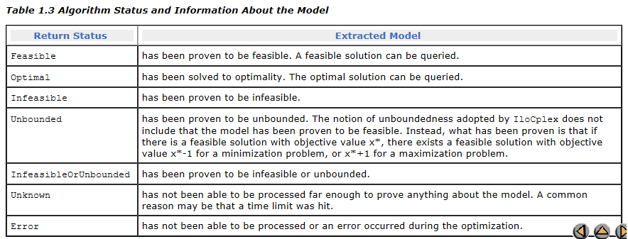
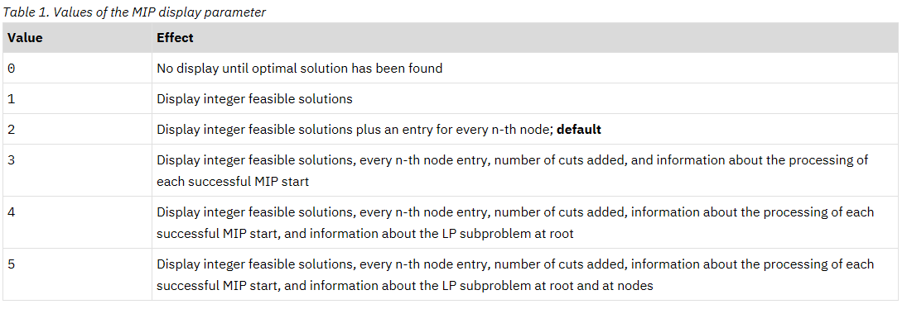

# CPLEX如何求解MIP

[TOC]

## CPLEX角度

**The process of solving a mixed integer programming problem** involves exploring a tree of linear programming relaxations. 

CPLEX repeatedly selects a node from the tree, solves the LP relaxation at that node, attempts to generate cutting planes to cut off the current solution, invokes a heuristic to try to find an integer feasible solution "close" to the current relaxation solution, selects a branching variable (an integer variable whose value in the current relaxation is fractional), and finally places the two nodes that result from branching up or down on the branching variable back into the tree. 

------

In the branch & cut algorithm, CPLEX solves a series of continuous subproblems. To manage those subproblems efficiently, CPLEX builds a tree in which each subproblem is a node. The root of the tree is the *continuous relaxation* of the original MIP problem.

If the solution to the relaxation has one or more fractional variables, CPLEX will try to find cuts. Cuts are constraints that cut away areas of the feasible region of the relaxation that contain fractional solutions. CPLEX can generate several types of cuts. ([Cuts](https://www.ibm.com/support/knowledgecenter/SSSA5P_12.8.0/ilog.odms.cplex.help/CPLEX/UsrMan/topics/discr_optim/mip/cuts/26_cuts_title_synopsis.html?view=kc) tells you more about that topic.)

If the solution to the relaxation still has one or more fractional-valued integer variables after CPLEX tries to add cuts, then CPLEX branches on a fractional variable to generate two new subproblems, each with more restrictive bounds on the branching variable. For example, with binary variables, one node will fix the variable at 0 (zero), the other, at 1 (one).

The subproblems may result in an all-integer solution, in an infeasible solution, or another fractional solution. If the solution is fractional, CPLEX repeats the process.

------

**After CPLEX finds an integer solution,** it does the following:

- It makes that integer solution the incumbent solution and that node the *incumbent node*.
- It makes the value of the objective function at that node (modified by the objective difference parameter) the new *cutoff* value.
- It prunes from the tree all subproblems for which the value of the objective function is no better than the incumbent.

CPLEX求解MIP的过程，本质上是求解LP问题，并采用branch and cut的方法。

1. [diving and backtracking](https://www.ibm.com/support/knowledgecenter/en/SSSA5P_12.7.0/ilog.odms.cplex.help/CPLEX/UsrMan/topics/discr_optim/mip/performance/19_srch_str.html)

   控制在分支过程中执行回溯的频率。

2. [Selecting nodes](https://www.ibm.com/support/knowledgecenter/en/SSSA5P_12.7.0/ilog.odms.cplex.help/CPLEX/UsrMan/topics/discr_optim/mip/performance/20_node_seln.html)

   用于设置用来在回溯时选择要处理的下一个节点的规则。

3. [Selecting variables](https://www.ibm.com/support/knowledgecenter/en/SSSA5P_12.7.0/ilog.odms.cplex.help/CPLEX/UsrMan/topics/discr_optim/mip/performance/21_var_seln.html)

   设置用于在已选择进行分支的节点处选择分支变量的规则。

4. [Changing branching direction](https://www.ibm.com/support/knowledgecenter/en/SSSA5P_12.7.0/ilog.odms.cplex.help/CPLEX/UsrMan/topics/discr_optim/mip/performance/22_br_dir.html)

   决定应在每个节点先采用哪个分支（向上或向下分支）。

| Interactive Optimizer Command   | Concert Technology IloCPLEX Method | Parameter Reference                                          |
| :------------------------------ | :--------------------------------- | :----------------------------------------------------------- |
| set mip strategy backtrack      | setParam(BtTol , n)                | [backtracking tolerance](https://www.ibm.com/support/knowledgecenter/SSSA5P_12.7.0/ilog.odms.cplex.help/CPLEX/Parameters/topics/BtTol.html?view=kc) |
| set mip strategy nodeselect     | setParam(NodeSel , i)              | [MIP node selection strategy](https://www.ibm.com/support/knowledgecenter/SSSA5P_12.7.0/ilog.odms.cplex.help/CPLEX/Parameters/topics/NodeSel.html?view=kc) |
| set mip strategy variableselect | setParam(VarSel , i)               | [MIP variable selection strategy](https://www.ibm.com/support/knowledgecenter/SSSA5P_12.7.0/ilog.odms.cplex.help/CPLEX/Parameters/topics/VarSel.html?view=kc) |
| set mip strategy bbinterval     | setParam(BBInterval , i)           | [MIP strategy best bound interval](https://www.ibm.com/support/knowledgecenter/SSSA5P_12.7.0/ilog.odms.cplex.help/CPLEX/Parameters/topics/BBInterval.html?view=kc) |
| set mip strategy branch         | setParam(BrDir , i)                | [MIP branching direction](https://www.ibm.com/support/knowledgecenter/SSSA5P_12.7.0/ilog.odms.cplex.help/CPLEX/Parameters/topics/BrDir.html?view=kc) |

## 用户角度

CPLEX求解MIP的过程，本质上是求解LP问题，并采用branch and cut的方法。

[一个java的CPLEX求解LP的简单例子](https://www.ibm.com/support/knowledgecenter/zh/SSSA5P_12.7.0/ilog.odms.cplex.help/CPLEX/GettingStarted/topics/tutorials/ataglance/Java.html)

```java
import ilog.concert.*;
import ilog.cplex.*;

public class Example {
  public static void main(String[] args) {
    try {
      IloCplex cplex = new IloCplex();

      double[]    lb = {0.0, 0.0, 0.0};
      double[]    ub = {40.0, Double.MAX_VALUE, Double.MAX_VALUE};
      IloNumVar[] x  = cplex.numVarArray(3, lb, ub);

      double[] objvals = {1.0, 2.0, 3.0};
      cplex.addMaximize(cplex.scalProd(x, objvals));

      cplex.addLe(cplex.sum(cplex.prod(-1.0, x[0]),
                            cplex.prod( 1.0, x[1]),
                            cplex.prod( 1.0, x[2])), 20.0);
      cplex.addLe(cplex.sum(cplex.prod( 1.0, x[0]),
                            cplex.prod(-3.0, x[1]),
                            cplex.prod( 1.0, x[2])), 30.0);

      if ( cplex.solve() ) {
        cplex.output().println("Solution status = " + cplex.getStatus());
        cplex.output().println("Solution value  = " + cplex.getObjValue());

        double[] val = cplex.getValues(x);
        int ncols = cplex.getNcols();
        for (int j = 0; j < ncols; ++j)
          cplex.output().println("Column: " + j + " Value = " + val[j]);
      }
      cplex.end();
    }
    catch (IloException e) {
      System.err.println("Concert exception '" + e + "' caught");
    }
  }
}
```

### 创建MIP model

[IBM-Concert Technology Java 应用程序剖析](https://www.ibm.com/support/knowledgecenter/zh/SSSA5P_12.7.0/ilog.odms.cplex.help/CPLEX/GettingStarted/topics/tutorials/Java/create_model.html)

1. 初始化`IloCplex`对象

   ```java
   IloCplex cplex = new IloCplex();
   ```

2. 创建变量、目标函数、约束条件

   | 建模类         | 描述                                                  |
   | -------------- | ----------------------------------------------------- |
   | `IloNumVar`    | variables                                             |
   | `IloRange`     | ranged constraints of the type $lb \leq expr \leq ub$ |
   | `IloObjective` | optimization objective                                |
   | `IloNumExpr`   | expression using variables                            |

   (1) 变量类型

   | Type of Variable | Java API            |
   | :--------------- | :------------------ |
   | binary           | IloNumVarType.Bool  |
   | integer          | IloNumVarType.Int   |
   | semi-continuous  | IloNumVarType.Float |
   | semi-integer     | IloNumVarType.Int   |

3. 建模方式包括：

   1) 按行建模
   2) 按列建模
   3) 按非零建模
   4) 使用`IloLPMatrix`进行高级建模
   
   备注：
   
   每一个建模变量必须出现在某一个约束中，否则会报错
   
4. 导出模型、导入模型

   `IloCplex.exportModel // 导出model`

   `IloCplex.importModel // 导入model`

### 修改模型

[修改model](https://www.ibm.com/support/knowledgecenter/zh/SSSA5P_12.7.0/ilog.odms.cplex.help/CPLEX/UsrMan/topics/APIs/Java/34_modify_model.html)

1. 修改模型的上下界

   `IloNumVar.setLB // 设置变量下界`

   `IloNumVar.setUB //设置变量上界`

2. 修改约束的上下界

   `IloRange.setLB`

   `IloRange.setUB`

3. 移除或添加约束

   `IloModel.add // 添加约束`

   `IloModel.remove //移除约束（不使用，但还是存在，可以重新添加回来）`

   `IloModel.delete //删除约束（删掉后就不存在了）`

4. 修改约束的系数
   
   `cplex.setLinearCoef(obj, w[i], x[i]);`
   `cplex.setLinearCoef(rng, w[i], x[i]);`

5. 修改约束
   
   `IloModel.addToExpr`

6. 覆盖变量类型
   
   变量类型不可更改。 但是，针对特定的模型，可通过添加 IloConversion 对象来覆盖变量类型，该对象允许对该模型中的变量指定新类型。

   ```
   IloNumVar x = cplex.numVar(0.0, 1.0);  
   cplex.add(cplex.conversion(x, IloNumVarType.Int));
   ```

### 对模型求解

`cplex.solve()`

> 如果找到了解（可能为可行解，也可能为最优解），则返回`true`, 如果没找到解（可能是`Infeasible`,也可能是`Unknown`)，则返回`false`。

### 获取解的信息

1. 解的状态

   [Accessing Solution Status](https://www.tu-chemnitz.de/mathematik/discrete/manuals/cplex/doc/userman/html/cpxUserIlocplex13.html)

   `cplex.getStatus()`

   

2. 目标函数的上下界

   ```java
   double objval = cplex.getObjValue(); // 目标值
   double lb =  cplex.getBestObjValue(); // 下界(minimization problem)
   ```

3. 决策变量的取值

   ```java
   double[] xval = cplex.getValues(x);
   ```

4. 添加的cuts的数目

   ```java
   cplex.getNcuts();
   ```

   

### Cplex的求解进度汇报

[IBM:Progress reports-interpreting the node log](https://www.ibm.com/support/knowledgecenter/SSSA5P_12.8.0/ilog.odms.cplex.help/CPLEX/UsrMan/topics/discr_optim/mip/para/52_node_log.html)

**控制显示信息的方式**



### 提供初始解

[IBM: Starting from a solution-MIP starts](https://www.ibm.com/support/knowledgecenter/en/SSSA5P_12.7.0/ilog.odms.cplex.help/CPLEX/UsrMan/topics/discr_optim/mip/para/49_mipStarts.html)

```java
IloNumVar[] startVar = new IloNumVar[m * n];
double[] startVal = new double[m * n];
for (int i = 0, idx = 0; i < m; ++i)
      for (int j = 0; j < n; ++j) {
          startVar[idx] = x[i][j];
          startVal[idx] = start[i][j];
          ++idx;
       }
cplex.addMIPStart(startVar, startVal);
startVar = null;
startVal = null;
```

### 控制CPLEX终止条件

[Terminating MIP optimization](https://www.ibm.com/support/knowledgecenter/en/SSSA5P_12.7.0/ilog.odms.cplex.help/CPLEX/UsrMan/topics/discr_optim/mip/usage/11_terminate.html)

The default value of the relative MIP gap tolerance is 1e-4. These default values indicate to CPLEX to stop when an integer feasible solution has been proved to be within 0.01% of optimality.

| To set a limit on           | Use this parameter                                           | Concert Technology |
| :-------------------------- | :----------------------------------------------------------- | :----------------- |
| elapsed time                | [optimizer time limit in seconds](https://www.ibm.com/support/knowledgecenter/SSSA5P_12.7.0/ilog.odms.cplex.help/CPLEX/Parameters/topics/TiLim.html?view=kc) | TiLim              |
| elapsed deterministic time  | [deterministic time limit](https://www.ibm.com/support/knowledgecenter/SSSA5P_12.7.0/ilog.odms.cplex.help/CPLEX/Parameters/topics/DetTiLim.html?view=kc) | DetTiLim           |
| number of nodes             | [MIP node limit](https://www.ibm.com/support/knowledgecenter/SSSA5P_12.7.0/ilog.odms.cplex.help/CPLEX/Parameters/topics/NodeLim.html?view=kc) | NodeLim            |
| size of tree                | [tree memory limit](https://www.ibm.com/support/knowledgecenter/SSSA5P_12.7.0/ilog.odms.cplex.help/CPLEX/Parameters/topics/TreLim.html?view=kc) | TreLim             |
| number of integer solutions | [MIP integer solution-file switch and prefix](https://www.ibm.com/support/knowledgecenter/SSSA5P_12.7.0/ilog.odms.cplex.help/CPLEX/Parameters/topics/IntSolFilePrefix.html?view=kc) | IntSolLim          |
| relative MIP gap tolerance  | [relative MIP gap tolerance](https://www.ibm.com/support/knowledgecenter/SSSA5P_12.7.0/ilog.odms.cplex.help/CPLEX/Parameters/topics/EpGap.html?view=kc) | EpGap              |
| absolute MIP gap tolerance  | [absolute MIP gap tolerance](https://www.ibm.com/support/knowledgecenter/SSSA5P_12.7.0/ilog.odms.cplex.help/CPLEX/Parameters/topics/EpAGap.html?view=kc) | EpAGap             |

### 控制Branch and Cut过程

1. [Diving and backtracking](https://www.ibm.com/support/knowledgecenter/en/SSSA5P_12.7.0/ilog.odms.cplex.help/CPLEX/UsrMan/topics/discr_optim/mip/performance/19_srch_str.html)

   控制在分支过程中执行回溯的频率。

   `BtTol`

   - $\to 0.0$: backtrack

   - $\to 1.0$: dive (default)

2. [Selecting nodes](https://www.ibm.com/support/knowledgecenter/en/SSSA5P_12.7.0/ilog.odms.cplex.help/CPLEX/UsrMan/topics/discr_optim/mip/performance/20_node_seln.html)

   用于设置用来在回溯时选择要处理的下一个节点的规则。

   `NodeSel`

   - Best Bound search (default)
   - Best Estimate search
   - Depth First search

3. [Selecting variables](https://www.ibm.com/support/knowledgecenter/en/SSSA5P_12.7.0/ilog.odms.cplex.help/CPLEX/UsrMan/topics/discr_optim/mip/performance/21_var_seln.html)

   设置用于在已选择进行分支的节点处选择分支变量的规则。

4. [Changing branching direction](https://www.ibm.com/support/knowledgecenter/en/SSSA5P_12.7.0/ilog.odms.cplex.help/CPLEX/UsrMan/topics/discr_optim/mip/performance/22_br_dir.html)

   决定应在每个节点先采用哪个分支（向上或向下分支）。

   | Concert Technology IloCPLEX Method | Parameter Reference                                          |
   | :--------------------------------- | :----------------------------------------------------------- |
   | setParam(BtTol , n)                | [backtracking tolerance](https://www.ibm.com/support/knowledgecenter/SSSA5P_12.8.0/ilog.odms.cplex.help/CPLEX/Parameters/topics/BtTol.html?view=kc) |
   | setParam(NodeSel , i)              | [MIP node selection strategy](https://www.ibm.com/support/knowledgecenter/SSSA5P_12.8.0/ilog.odms.cplex.help/CPLEX/Parameters/topics/NodeSel.html?view=kc) |
   | setParam(VarSel , i)               | [MIP variable selection strategy](https://www.ibm.com/support/knowledgecenter/SSSA5P_12.8.0/ilog.odms.cplex.help/CPLEX/Parameters/topics/VarSel.html?view=kc) |
   | setParam(BBInterval , i)           | [MIP strategy best bound interval](https://www.ibm.com/support/knowledgecenter/SSSA5P_12.8.0/ilog.odms.cplex.help/CPLEX/Parameters/topics/BBInterval.html?view=kc) |
   | setParam(BrDir , i)                | [MIP branching direction](https://www.ibm.com/support/knowledgecenter/SSSA5P_12.8.0/ilog.odms.cplex.help/CPLEX/Parameters/topics/BrDir.html?view=kc) |
   
   