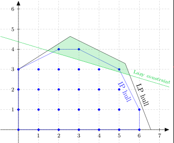

# CPLEX的Callback

[TOC]

[**User Cuts versus Lazy Constraints**](https://orinanobworld.blogspot.com/2012/08/user-cuts-versus-lazy-constraints.html)

## **User cuts**

In CPLEX parlance, a **cut** is a constraint that is not part of the original model and does not eliminate any feasible integer solutions.

A **user cut** is simply a cut added by the user, rather than by CPLEX, frequently but not necessarily inside a callback.

### **Lazy Constraints**

**lazy constraints** are allowed to pare away integer-feasible solutions.

> The implication of using lazy constraints is that the problem originally specified first figure) is actually a relaxation of the true problem; adding the lazy constraints to that initial problem gives you the problem you really want to solve.

- After every **fractional** solution is generated, we can have a [UserCutCallback](http://pic.dhe.ibm.com/infocenter/cosinfoc/v12r4/index.jsp?topic=%2Filog.odms.cplex.help%2Frefjavacplex%2Fhtml%2Filog%2Fcplex%2FIloCplex.UserCutCallback.html) that allows us to search for constraints violated by the fractional solution.
- After every **integer** solution is generated, we can have a [LazyConstraintCallback](http://rma350.github.io/2012/06/16/LazyConstraintCallback.html) that allows us to search for constraints violated by the integer solution.

