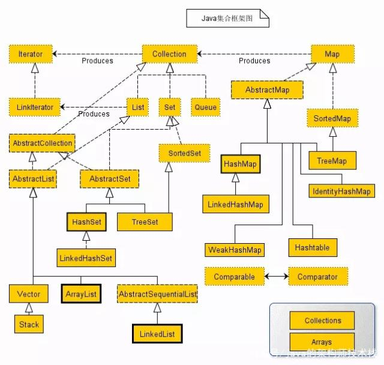

# Java中的简单算法


## 位运算

### 十进制转为指定位数的二进制

```
int value = 1 << digit | num;
String str = Integer.toBinaryString(value);
return str.substring(1);
```


### 判断整数对应的二进制第i位是否为1

```
if (((j >> i) & 1) == 1)
    return true;
```


### 计算一个整数对应的二进制中1的个数

请实现一个函数，输入一个整数，输出该数二进制表示中1的个数。例如把9表示成二进制是1001，有2位是1。因此如果输入9，该函数输出2。

> 位运算

```java
public int numberOf1(int n) {
    int sum = 0;
    while(n != 0){
        sum++;
        n = n & (n - 1);
    }
    return sum;
}
```

## 获取计算机的IP、名称、操作系统等信息

> Java获取计算机的IP、名称、操作系统等信息](https://blog.csdn.net/chen_pt/article/details/52806576)

```java
InetAddress addr = InetAddress.getLocalHost();   
String ip=addr.getHostAddress().toString(); //获取本机ip  
String hostName=addr.getHostName().toString(); //获取本机计算机名称  
System.out.println("本机IP："+ip+"\n本机名称:"+hostName);  
Properties props=System.getProperties();  
System.out.println("操作系统的名称："+props.getProperty("os.name"));  
System.out.println("操作系统的版本："+props.getProperty("os.version"));  
Properties props=System.getProperties();  
System.out.println("Java的运行环境版本："+props.getProperty("java.version"));  
System.out.println("Java的运行环境供应商："+props.getProperty("java.vendor"));  
System.out.println("Java供应商的URL："+props.getProperty("java.vendor.url"));  
System.out.println("Java的安装路径："+props.getProperty("java.home"));  
System.out.println("Java的虚拟机规范版本："+props.getProperty("java.vm.specification.version"));  
System.out.println("Java的虚拟机规范供应商："+props.getProperty("java.vm.specification.vendor"));  
System.out.println("Java的虚拟机规范名称："+props.getProperty("java.vm.specification.name"));  
System.out.println("Java的虚拟机实现版本："+props.getProperty("java.vm.version"));  
System.out.println("Java的虚拟机实现供应商："+props.getProperty("java.vm.vendor"));  
System.out.println("Java的虚拟机实现名称："+props.getProperty("java.vm.name"));  
System.out.println("Java运行时环境规范版本："+props.getProperty("java.specification.version"));  
System.out.println("Java运行时环境规范供应商："+props.getProperty("java.specification.vender"));  
System.out.println("Java运行时环境规范名称："+props.getProperty("java.specification.name"));  
System.out.println("Java的类格式版本号："+props.getProperty("java.class.version"));  
System.out.println("Java的类路径："+props.getProperty("java.class.path"));  
System.out.println("加载库时搜索的路径列表："+props.getProperty("java.library.path"));  
System.out.println("默认的临时文件路径："+props.getProperty("java.io.tmpdir"));  
System.out.println("一个或多个扩展目录的路径："+props.getProperty("java.ext.dirs"));  
System.out.println("操作系统的名称："+props.getProperty("os.name"));  
System.out.println("操作系统的构架："+props.getProperty("os.arch"));  
System.out.println("操作系统的版本："+props.getProperty("os.version"));  
System.out.println("文件分隔符："+props.getProperty("file.separator"));//在 unix 系统中是＂／＂
System.out.println("路径分隔符："+props.getProperty("path.separator"));//在 unix 系统中是＂:＂ 
System.out.println("行分隔符："+props.getProperty("line.separator"));//在 unix 系统中是＂/n＂ System.out.println("用户的账户名称："+props.getProperty("user.name"));  
System.out.println("用户的主目录："+props.getProperty("user.home"));  
System.out.println("用户的当前工作目录："+props.getProperty("user.dir"));  
```

## 字符串String

### String.`format`

| 转  换  符 | 说    明                                    | 示    例     |
| ---------- | ------------------------------------------- | ------------ |
| %s         | 字符串类型                                  | "mingrisoft" |
| %c         | 字符类型                                    | 'm'          |
| %b         | 布尔类型                                    | true         |
| %d         | 整数类型（十进制）                          | 99           |
| %x         | 整数类型（十六进制）                        | FF           |
| %o         | 整数类型（八进制）                          | 77           |
| %f         | 浮点类型                                    | 99.99        |
| %a         | 十六进制浮点类型                            | FF.35AE      |
| %e         | 指数类型                                    | 9.38e+5      |
| %g         | 通用浮点类型（f和e类型中较短的）            |              |
| %h         | 散列码                                      |              |
| %%         | 百分比类型                                  | ％           |
| %n         | 换行符                                      |              |
| %tx        | 日期与时间类型（x代表不同的日期与时间转换符 |              |

### int转string， 位数不足补0

```
String.format("%06d",12);//其中0表示补零而不是补空格，6表示至少6位  
```


## 数组和Collections篇

[java集合类框架](https://baijiahao.baidu.com/s?id=1635960586900914735&wfr=spider&for=pc)


### 数据结构的存取

队列中的进与取

先进先出

存：offer(Obj)

取：poll()

栈的进与出

先进后出

进：push(Obj)

出：pop()

集合的添加与获取

添加：add(ele)

获取：get(index)

### List一遍遍历，一边删除

1. 使用Iterator的remove()方法

``` java
Iterator<String> iterator = platformList.iterator();
while (iterator.hasNext()) {
    String platform = iterator.next();
    if (platform.equals("博客园")) {
        iterator.remove();
    }
}
```

2. 使用for循环正序遍历

``` java
for (int i = 0; i < platformList.size(); i++) {
    String item = platformList.get(i);

    if (item.equals("博客园")) {
        platformList.remove(i);
        i = i - 1; // note
    }
}
```

3. 使用for循环倒序遍历

``` java
for (int i = platformList.size() - 1; i >= 0; i--) {
    String item = platformList.get(i);

    if (item.equals("掘金")) {
        platformList.remove(i);
    }
}
```

### List中的`remove`方法的正确使用

**正确**

1. 使用for循环，并且同时改变索引

```
//正确
for(int i=0;i<list.size();i++) {
	if(list.get(i)%2==0) {
		list.remove(i);
		i--;//在元素被移除掉后，进行索引后移
	}
}
```

2. 使用for循环，倒序进行

```
//正确
for(int i=list.size()-1;i>=0;i--) {
	if(list.get(i)%2==0) {
		list.remove(i);
	}
}
```

3. 只能使用迭代器的remove()方法，使用列表的remove()方法是错误的

```
//正确，并且推荐的方法
Iterator<Integer> itr = list.iterator();
while(itr.hasNext()) {
	if(itr.next()%2 ==0)
		itr.remove();
}
```

**错误**

1. 使用for循环不进行额外处理时

```
//错误
for(int i=0;i<list.size();i++) {
	if(list.get(i)%2==0) {
		list.remove(i);
	}
}
```

2. 使用foreach循环

```
//错误
for(Integer i:list) {
    if(i%2==0) {
     	list.remove(i);
    }
}
```

### 数组和`ArrayList`相互转换

`ArrayList`-->数组

```java
String[] array = (String[])list.toArray(new String[size]);    
```

 数组-->`ArrayList`

```java
List<String>  list=Arrays.asList(array);    
```

通用的方法

```java
int[] arr = new int[list.size()];
for(int i = 0; i < arr.length; ++i)
	arr[i] = list.get(i);
```

### 如何创建大小不同的二维数组

> 数组的每一维的大小可以不一致。

```java
int [][] arr ;  
arr = new int [一维数][];    //创建第一维
for ( i = 0 ; i < 一维数 ; i++ ) {  
      arr [i] = new int [二维数];    //创建第二维  
      for( j=0 ; j < 二维数 ; j++) { 
            arr [i][j] = j;   
      }  
 }
```

### 二维数组的排序：根据第一维元素排序，如果相同则根据第二维元素排序

```java
Arrays.sort(arr, new Comparator<int[]>) {
	public int compare (int[] a, int[] b) {
		if (a[0] == b[0]) {
			return a[1] - b[1]; // ascending order
		}
		return a[0] - b[0]; // ascending order
	}
}
```

```java
// sort activities in ascending order of start times
public int[] sort(int[] arr, int[] s) {
    int[] order = arr.clone();
    for (int i = 0; i < order.length - 1; ++i) {
        for (int j = 0; j < order.length - i - 1; ++j) {
            if (s[order[j]] > s[order[j + 1]]) {
                int temp = order[j];
                order[j] = order[j + 1];
                order[j + 1] = temp;
            }
        }
    }
    return order;
}
```


### 排序：Comparator 与 Comparable 与lambda

1. 实现Comparable接口的类的对象

    ```
    public class Hero implements Comparable<Hero>{
        public String name;
        public float hp; 
        public int damage;
        
        @Override
        public int compareTo(Hero anotherHero) {
            if(damage<anotherHero.damage)
                return 1; 
            else
                return -1;
        }
    }
    ```

    备注：直接作用在类Hero上，当有排序要求时，自动按照该原则排序。

2. 实现Comparator接口的类的对象作为sort的入参

   ```
   public class HumanComparetor implements Comparator<Human> {
       @Override
       public int compare(Human h1, Human h2) {
           if (h1.getAge() > h2.getAge()) {
               return 1;
           } else if (h1.getAge() == h2.getAge()) {
               return 0;
           } else {
               return -1;
           }
       }
   }
   ```

   备注：实际上是个排序器，可以有多个排序器，不作用在类Human上。

3. 在方法内使用匿名类

    ```
    public static void main(String[] args) {
        List<Human> humans = Human.getAInitHumanList();
        //匿名类
        Collections.sort(humans, new Comparator<Human>() {
            @Override
            public int compare(Human h1, Human h2) {
                return h1.getAge() - h2.getAge();
            }
        });
        System.out.println(humans);
    }
    ```

4. 使用lamdba表达式->这种形式

    ```
    public static void main(String[] args) {
        List<Human> humans = Human.getAInitHumanList();
        //lamdba 表达式 ->
        Collections.sort(humans, (Human h1, Human h2) -> h1.getAge() - h2.getAge());
        System.out.println(humans);
    }
    ```

### 排序：`Collections.sort(List)`与`List.sort()`

> [ArrayList.sort & Collections.sort](https://www.cnblogs.com/exigeslover/p/11961332.html)

1. 首先明确`Collections`与`Collection`是不同的。`List` → `Collection`，`Collection`是集合框架，`Collections`是单独的工具类。`Collections.sort()`是静态方法，`List.sort()`是成员方法

2. `Collections.sort()`实际上还是对`List`对象操作，没有本质区别

    ``` java
    public static <T> void sort(List<T> list, Comparator<? super T> c) {
        list.sort(c);
    }
    ```


### 判断数组是否包含某个元素

> [Java中如何高效的判断数组中是否包含某个元素](https://blog.csdn.net/yuanquanl/article/details/53672978)

使用一个**简单的循环方法**比使用任何集合都更加高效。许多开发人员为了方便，都使用第一种方法，但是他的效率也相对较低。因为将数组压入Collection类型中，首先要将数组元素遍历一遍，然后再使用集合类做其他操作。

- 使用`List`

  ```java
  public boolean useList(String[] arr, String target) {
  	return Arrays.asList(arr).contains(target);
  }
  ```

- 使用`Set`

  ```java
  public boolean useSet(String[] arr, String target) {
  	Set<String> set = new HashSet<String>(Arrays.asList(arr));
  	return set.contains(target);
  }
  ```

- 使用循环

  ```java
  public boolean useLoop(String[] arr, String target) {
  	for (String str: arr){
  		if(str.equals(target)) {
  			return true;
  		}
  	}
  	return false;
  }
  ```

### 输出数组的所有元素

`Arrays.toString()`

```java
String[] array = new String[] { "First", "Second", "Third", "Fourth" };
System.out.println(Arrays.toString(array));
```

### 数组乱序

- 转换成`ArrayList`，然后使用`Collections.shuffle();`

- 自己写对应数组的`Collections.shuffle()`

  ```java
  void shuffle(int[] pop){
      for (int i=pop.length - 1; i>=0; --i){
          int rndNum = Global.rnd.nextInt(i + 1);
          int temp = pop[rndNum];
          pop[rndNum] = pop[i];
          pop[i] = temp;
      }
  }
  ```


### removeIf()  in ArrayList

> The **removeIf()** method of **ArrayList** is used to remove all of the elements of this ArrayList that satisfies a given predicate filter which is passed as a parameter to the method.

```java
// create an ArrayList which going to 
// contains a list of Numbers 
ArrayList<Integer> Numbers = new ArrayList<Integer>(); 
// Add Number to list 
Numbers.add(23); 
Numbers.add(32); 
Numbers.add(45); 
Numbers.add(63); 
// apply removeIf() method 
// we are going to remove numbers divisible by 3 
Numbers.removeIf(n -> (n % 3 == 0)); 
for (int i : Numbers) {
	System.out.println(i);  // 23, 32
} 
```

### remove() in `ArrayList<Integer>`

```
remove(int a); // 删除第a个元素
remove(Integer a); // 删除元素a
```


### Foreach的遍历顺序

引用：[Java中foreach的遍历顺序](https://www.jianshu.com/p/81cec83541be)

Java的foreach是一种增强的for结构，其形式如下

```java
for (variable : collection) statement
```

foreach主要用于遍历数组或容器的元素。

**对于数组**，上述语句等同于

```java
for (int i = 0; i < collection.length; i++) {
    variable = collection[i];
    Statement
}
```

**对于Iterable容器**，上述语句等同于

```java
for (I i = collection.iterator(); i.hasNext(); ) { 
    variable = i.next(); 
    Statement
}
```

### Heap Data Structure in Java

引用：[Heap Data Structure](https://www.geeksforgeeks.org/heap-data-structure/)

Java中通过`PriorityQueue`实现Heap data structure。Heap是一种完全二叉树。


### 深拷贝

引用：[实现对象的拷贝](https://blog.csdn.net/caoxiaohong1005/article/details/78704890)

Java中存在两种方式可以实现对象的深拷贝。深拷贝的意思是，拷贝后的对象和原对象毫无关系。深拷贝与浅拷贝的区别体现在两层及以上引用的对象中，对于只有一层的引用的对象倒没有体现出区别。本质上在于深拷贝复制了**对象**，浅拷贝复制了**引用**。
两种实现深拷贝的方法：
1. 实现`Cloneable`接口，并重写`clone()`方法。
2. 实现`Serializable`接口，通过序列化方式实现深拷贝。

``` java
class Person{
        String name;
        int age;
        // methods
}
 
class Animal{
        Person hose;//主人
        int age;//年纪
}
```

浅拷贝的问题在于：由于`Person`也是一个引用对象，所以直接使用`person2 = person1.clone()`只能实现浅拷贝。person2和person1的email指向同一个地址。

+ 方法一
 ``` java
class Person implements Cloneable{
       String name;
       int age;
       Person(String name,int age){
               this.name=name;
               this.age=age;
       }
       @Override
       public Object clone() {
               try{
                       return  super.clone();
               }catch(CloneNotSupportedException e){
                      return null;
               }
       }
 }
 class Animal implements Cloneable{
       Person host;//主人
       int age;//年纪
       Animal(Person person,int age){
               this.host=person;
               this.age=age;
       }
       @Override
       public Object clone(){
               try{
                       Animal animal=(Animal) super.clone();
                       animal.host=(Person)host.clone();//深拷贝处理
                       return animal;
               }catch (CloneNotSupportedException e){
                       return null;
               }
       }
}
 ```

方法一存在局限，当`Animal`类中存在多层(超过两层)引用或者自己引用自己时，变得不可用。

+ 方法二

工具类`CloneUtil`

```java
public class CloneUtils {
    public static <T extends Serializable> T clone(T obj){
        T cloneObj = null;
        try {
            //写入字节流
            ByteArrayOutputStream out = new ByteArrayOutputStream();
            ObjectOutputStream obs = new ObjectOutputStream(out);
            obs.writeObject(obj);
            obs.close();
            //分配内存，写入原始对象，生成新对象
            ByteArrayInputStream ios = new ByteArrayInputStream(out.toByteArray());
            ObjectInputStream ois = new ObjectInputStream(ios);
            //返回生成的新对象
            cloneObj = (T) ois.readObject();
            ois.close();
        } catch (Exception e) {
            e.printStackTrace();
        }
        return cloneObj;
    }
}
```

序列化后的`Person`和`Animal`
```java
class Person implements Serializable{
        String name;
        int age;
        Person(String name,int age){
                this.name=name;
                this.age=age;
        }
 
}

class Animal implements Serializable{
        Person host;//主人
        int age;//年纪
        Animal(Person person,int age){
                this.host=person;
                this.age=age;
        }
}
```

### PriorityQueue和TreeSet区别

1. PriorityQueue可以有重复项，因为TreeSet不能有重复项。因此，在Treeset中，如果您的比较器认为2个元素相等，则TreeSet将仅保留这2个元素之一，而丢弃另一个元素。
2. TreeSet保证了所有元素按顺序排列，PriorityQueue只保证了最小或最大元素排在队首，其他元素的顺序不保证顺序。所以，TreeSet的维护成本更高。如果只想获得最小元素可以考虑PriorityQueue。
3. PriorityQueue每次删除或添加操作后进行重排列，保证最小或最大元素在队首。但是如果仅仅是改变已有元素的值，则不会重排列，所以会出现最小元素不在队首。

### PriorityQueue

引用：[JDK源码研究PriorityQueue](https://blog.csdn.net/JThirteen/article/details/84420882)

### HashSet存储自定义对象

当使用hashSet存储自定义对象时，需要重写`equals()`和`hashCode()`。

[如何重写](https://blog.csdn.net/neosmith/article/details/17068365)[hashCode()](https://blog.csdn.net/neosmith/article/details/17068365)[和](https://blog.csdn.net/neosmith/article/details/17068365)[equals()](https://blog.csdn.net/neosmith/article/details/17068365)[方法](https://blog.csdn.net/neosmith/article/details/17068365)

对于String、Integer类由于系统已经重写`equals()`和`hashCode()`，所以不需要用户再次重写。

### 链表的深拷贝
带有random指针的复杂链表的深拷贝

引用:[Java 算法 复制带随机指针的链表](https://www.jianshu.com/p/8b0688ed7afb)

```java
public RandomListNode copyRandomList(RandomListNode head) {
    if (head == null) {
        return null;
    }
    RandomListNode p = head;
    //第一步，将原节点的next指向对应的新节点
    //新节点的next指向原节点的原next
    while (p != null) {
        RandomListNode newP = new RandomListNode(head.label);
        newP.next = p.next;
        p.next = newP;
        p = newP.next;
    }
    //第二步，参照原节点的random指向，改变新节点的random指向
    p = head;
    while (p != null) {
        //p.next 就是当前节点对应的新节点
        p.next.random = p.random == null ? null : p.random.next;
        p = p.next.next;
    }
    //第三步，恢复
    RandomListNode newHead = head.next;
    p = head;
    RandomListNode q = newHead;
    while (p != null) {
        p.next = q.next;
        if (q.next != null) {
            q.next = q.next.next;
        }
        p = p.next;
        q = q.next;
    }
    return newHead;
}
```

双向链表的深拷贝
``` java
public PriorityQueue<HSegment> deepCloneH(PriorityQueue<HSegment> hSkyline) {
    PriorityQueue<HSegment> skyline = new PriorityQueue<>();
    HSegment head = getHeadH(hSkyline);
    if (head == null)
        return skyline;
    HSegment p = head;
    // step 1. copy the nodes and insert each copied node after the orginal node
    while (p != null) {
        HSegment seg = new HSegment(p.x, p.y, p.w);
        seg.next = p.next;
        p.next = seg;
        p = seg.next;
        skyline.add(seg);
    }
    // step 2. detach the coplied nodes from the orginal list
    p = head;
    HSegment q = head.next;
    while (p != null && q != null) {
        // update the values of next
        p.next = q.next;
        if (q.next != null)
            q.next = q.next.next;
        // get the prev elements from the values of next
        if (p == head) {
            p.prev = null;
            q.prev = null;
        }
        if (p.next != null)
            p.next.prev = p;
        if (q.next != null)
            q.next.prev = q;
        p = p.next;
        q = q.next;
    }
    return skyline;
}
```


## 输入输出篇

### 文件重命名

`renameTo()`

```java
File oldfile = new File("/home/a.txt");
File newfile = new File("/home/b.txt");
boolean ok = oldfile.renameTo(newfile);
if (ok) {
	System.out.println("Successfully.");
} else {
	System.out.println("Failed.");
}
```

### 从文件中读入数据

```java
read(String fileName) {
    Scanner in = null;
    try {
      File file = new File(fileName);
      in = new Scanner(new BufferedReader(new FileReader(file)));
      in.nextLine();
      int a = in.nextInt();
    in.close();
    } catch (Exception e) {
      e.printStackTrace();
    }
}
```

### 向文件写入数据

```java
BufferedWriter out =null;
out=new BufferedWriter(new?OutputStreamWriter(new FileOutputStream(file,true)));
out.write("****");
out.close();
```

## 小数篇

### 四舍五入并保留指定位小数

引用：[JAVA笔记:double四舍五入并保留两位小数的方法](https://blog.51cto.com/glblong/1312340)

方法一：`String.format()`

```java
double x1 = 0.33555555;
System.out.println(String.format("%.2f", x1));
% x1的值没有变化，只是输出变化
```

方法二：`DecimalFormat`

```java
double x1 = 0.33555555;
DecimalFormat df = new DecimalFormat("#0.00");  
String st = df.format(x1);
```

## 判断相等

```
数组
	int[] a = new int[]{1,2};
	int[] b = new int[]{1,2};
	System.out.println(a == b);	
	--> false	
String
	String a = "1,2";
	String b = "1,2";
	System.out.println(a == b);	
	--> true	
	String a = new String("1,2"); // 注意区别
	String b = new String("1,2");
	System.out.println(a == b);	
	--> false
注：String 属于引用类型，= 判断引用位置是否相同
       equals() 和 = 相同，但是String 重写 equals 方法。

```

## 正则表达式

### 正则表达式处理数字

```
// 判断一个字符串是否都为数字  
public boolean isDigit(String strNum) {  
    return strNum.matches("[0-9]{1,}");  
 }  
   
// 判断一个字符串是否都为数字  
public boolean isDigit(String strNum) {  
   Pattern pattern = Pattern.compile("[0-9]{1,}");  
   Matcher matcher = pattern.matcher((CharSequence) strNum);  
   return matcher.matches();  
}  

//截取数字  
public String getNumbers(String content) {  
     Pattern pattern = Pattern.compile("\\d+");  
     Matcher matcher = pattern.matcher(content);  
     while (matcher.find()) {  
         return matcher.group(0);  
    }  
     return "";  
}  
  
// 截取非数字  
public String splitNotNumber(String content) {  
   Pattern pattern = Pattern.compile("\\D+");  
   Matcher matcher = pattern.matcher(content);  
   while (matcher.find()) {  
       return matcher.group(0);  
    }  
   return "";  
}  

```

## 实现树Tree

[Java Tree Data Structure](https://www.javagists.com/java-tree-data-structure)