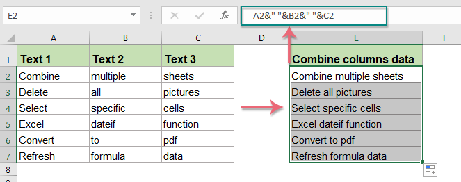

# OFFICE使用说明

[TOC]

## EXCEL

### 拆分单元格

1. `数据`--`分列`

2. `分割符号`or `固定长度`--`下一步`--`完成`

   引用：[拆分单元格](https://support.office.com/zh-cn/article/拆分单元格-f1804d0c-e180-4ed0-a2ae-973a0b7c6a23)

### 合并or连接单元格

1. 方法一：Use "&" Operator To Combine Cells

2. 方法二：Use Textjoin Function To Combine Cells

3. 方法三：Use Concatenate Function To Combine Cells

   引用：[How To Combine Multiple Cells Into A Cell With Space, Commas Or Other Separators In Excel?](https://www.extendoffice.com/documents/excel/1252-excel-combine-cells-with-space-commas-semicolon.html)

### 统计区间个数

1. 插入数据透视表

2. 将待分组数组作为行标签，值为计数项

3. 行标签下选择分组选择

   引用：[百度经验](https://jingyan.baidu.com/article/0aa223756bceee88cc0d642a.html)

### 快速将Excel的一列数据转换成数组格式

1. 将EXCEL的一列数据复制到word中，并且只保留文本；
2. 启用“替换”功能，将所有“段落记号”替换成“,”即可。

### Excel绘制甘特图

引用：[如何使用 Excel 绘制甘特图](https://www.zhihu.com/question/20995941)

1. 插入堆积条形图
2. 选择纵坐标轴，设置格式为“逆序类别”

## WORD

### 添加参考文献

1. 为参考文献设计样式
2. 插入交叉引用

### 添加图标的引用

1. 添加题注
2. 插入交叉引用

### 批量更新阈

方法一： 选择“打印预览”，可以更新文档中的所有阈

方法二：`ctrl` + `A`, 然后`f9`即可

## POWERPOINT