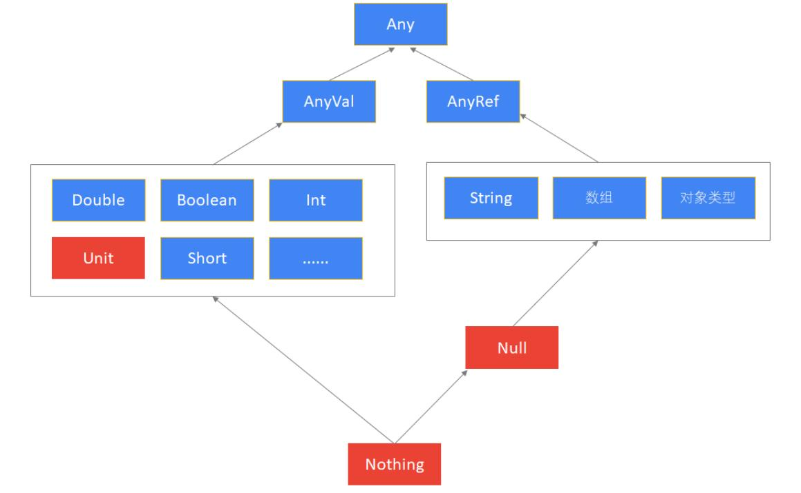

# Scala学习指南

---


[Bilibili](https://www.bilibili.com/video/BV1hy4y1z7Am?p=2)

## 基本语言结构

> 变量、表达式、if、循环、方法、函数

### 变量

```scala
// val 不可重新赋值
// var 可重新赋值
val/var a: Int = 10
// lazy 惰性赋值 针对于一长串的sql语句 只有被使用时才会被加载到JVM
lazy val/var s = "long text" 
// 自动类型推断
val name = "zhangsan" 
```

### 字符串

```scala
// 双引号
val name = "zhangsan"
println(name + ", " + name.length)
// 插值表达式 -- 字符串的拼接
val name = "zhangsan"
val age = 30
val sex = "male"
println(s"name=${name}, age=${age}, sex=${sex}")
// 三引号 -- 多行字符串
val sql = """ line 0
line 1
line 2
line 3
"""
```

### 数据类型与操作符

1. 基本数据类型：Byte Short Int Long Char String Float Double Boolean （大写开头）

2. 自动类型推动

3. 无 ++  -- 

4. `eq` `equals`  `==`
    ```scala
   eq // 地址 -- ne
   equals // 值
   == // 当比较对象不是null，相当于equals -- !=
   ```
   
5. Any AnyVal AnyRef -- Nothing Unit Null

    

### 条件表达式

1. 没有三元表达式

2. `if`条件表达式具有返回值，可以替代三元表达式

    ```scala
    val sex = "male"
    val result = if(sex == "male") 1 else 0
    ```

3. `{}`块表达式具有返回值

    ```scala
    val a = {
        println("1 + 1 = 2")
        1 + 1 // 返回值 a = 2
    }
    ```

### 循环表达式

#### for表达式

```scala
for(i <- 表达式\数组\集合)
for(i <- 1 to 10) // 1 to 10 等同于 1.to(10)
```

嵌套循环

```scala
for(i <- 1 to 3; j <- 1 to 5) {print("*"); if (j == 5) println()}
```

守卫：for表达式 + if表达式

```scala
for(i <- 1 to 10 if i % 3 == 0) println(i)
```

for推导式：for + yield

```scala
val v = for (i <- 1 to 10) yield i * 10 // 生成集合IndexedSeq
```

#### while循环

```scala
var i = 0
while(i <= 10){
  println(i)
  i = i + 1 // 无 ++  --
}
```

#### break与continue

无 break  continue 关键字

scala.util.control.Breaks_

实现break

```scala
import scala.util.control.Breaks._
breakable{ // 循环体外
  for (i <- 1 to 100) { 
      if (i > 50) break()
      else println(i)
  }
}
```

实现continue

```scala
import scala.util.control.Breaks._

for (i <- 1 to 100) { 
    breakable{ // 循环体内
        if (i % 10 == 0) break()
        else println(i)
	}
}
```

### 方法

```scala
def add(x: Int, y: Int) : Int = x + y // 无需写return 块表达式具有返回值
def add(x: Int, y: Int) = x + y // 返回值自动类型推断
```

💡递归方法的返回值类型不可省略

方法参数

```scala
def add(x: Int = 0, y: Int = 0) = x + y // 默认参数值 
// add() = 0, add(x=1) = 1
def sum(x : Int*) = x.sum // 变长参数
// sum(1,2,3) = 6
```

方法调用

```scala
Math.abs(-1) = 1
Math abs -1 = 1 // 等同于Math.abs(-1)
Math.abs {
    println("求绝对值")
    -1 // 块表达式的返回值 == Math.abs(-1)
}
```

💡操作符即方法

```scala
1 to 10 // 等同于 1.to(10)
1 + 1 // 等同于1.+(1)
```

💡调用无参数的方法时可以省略()

```scala
def printHello() = println("hello world")
printHello
```

### 函数

> Scala支持函数式编程

```scala
(x: Int, y: Int) => x + y
val add = (x: Int, y: Int) => x + y
```

💡函数与方法的不同

> 函数是一个对象，可以赋值给一个变量，运行时加载到jvm的堆内存中
>
> 方法是隶属于类或者对象的，运行时加载扫jvm的方法区
>
> 函数是一个对象，继承自FunctionN，具有apply curried toString tupled等方法

方法转换为函数

```scala
def add(x: Int, y: Int) = x+y
val a = add _
```

## 集合使用

> 数组、元组、List、Set、Map

### 数组

#### 定长数组 Array

定长数组：长度不可改变、元素可以改变（区别于List)

```scala
val/var a = new Array[Int](4) // new 指定大小
val/var a = Array(1, 3, 4, 6) 

val a = Array("java", "scala", "python") // 自动类型推断 Array[String]
a(0) = "cpp"
a.length
```

#### 变长数组 ArrayBuffer

scala.collection.mutable.ArrayBuffer

```scala
val/var nums = ArrayBuffer(1, 3, 4, 6)
```

```scala
val c = ArrayBuffer("hadoop", "spark", "flink")
c += "flume" // 添加元素
c -= "hadoop" // 删除元素
c += ("hive", "sqoop") // 依次添加元素
c ++= Array("hive", "sqoop") // 追加数组
c(0) = "s" // 修改元素
```

#### 遍历数组

```scala
val a = Array(1, 2, 3, 4, 5)
for(i <- a) println(i)
for(i <- 0 until a.length) println(a(i))
```

#### 数组常用方法

```scala
val a = Array(1, 6, 3, 4)
a.sum // 求和
a.max // 求最大值
a.min // 求最小值
a.sorted // 升序，生成了新数组，a没有变
// 降序：sorted + reverse
```

### 元组

元组可以包含不同类型的元素。元组元素不可修改。

```scala
val/var a = (1, "zhangsan", 30, "beijing")
val/var a = "zhangsan" -> 20 // 仅两个元素
```

访问元组从1开始

```scala
val a = ("zhangsan","male")
a._1
a._2
```

### 列表

元素可重复、有顺序

#### 不可变列表 List

不可变列表 (immutable)：长度和元素都是不可变的

```scala
val/var a = List(1, 2, 2, 4) 
val/var a = Nil // 不可变的空列表
val/var a = 1 :: 2 :: Nil
```

#### 可变列表 ListBuffer

可变列表 (mutable)：长度和元素都是可变的

scala.collection.mutable.ListBuffer

```scala
val/var a = ListBuffer(1, 2, 3, 4) // 自动类型推断
```

可变列表的操作

```scala
val c = ListBuffer(1, 2, 3)
c(0) // 获取元素
c += 4 // 添加元素
c ++= List(5, 6, 7) // 追加列表
c -= 7 // 删除元素
c.toList // “转换”为列表，生成了新的List
c.toArray // ”转换“为数组，生成了新的Array
```

#### 列表常用操作

```scala
val a = List(1, 2, 3, 4)
a.isEmpty // 判断是否为空
a.reverse // 反转，生成新列表
val a = List(1, 2, 3)
val b = List(4, 5, 6)
a ++ b // 拼接列表，生成新列表

val a = List(1, 5, 3, 4, 2)
a.head // 第一个元素 -- 1
a.tail // 获取除第一个元素外的所有元素 -- List(5,3,4,2)
a.take(2) // 获取前2个元素 -- List(1,5)
a.drop(2) // 获取除前2个元素外的剩余元素 -- List(3,4,2)

val a = List(List(1,5), List(3), List(4, 5))
a.flatten // 压平 生成新列表 List(1，5，3，4，5)}

val a = List("zhangsan", "lisi", "wangwu")
val b = List(18, 20, 19)
val c = a.zip(b) // 生成新列表 List((zhangsan,18), (lisi,20), (wangwu,19))
c.unzip // 生成元组 (List(zhangsan, lisi, wangwu),List(18, 20, 19))

val a = List(1,2,3,4)
a.toString // String = List(1, 2, 3, 4)
a.mkString(":") // 生成指定分隔符的字符串 String = 1:2:3:4

val a = List(1,2,3,4)
val b = List(3,4,5,6) 
val c = a union b // 等同于 a.union(b) 合并 不去重 生成新List
c.distinct // 去重

val c = a intersect b // 交集
val c = a.diff(b) // 差集
```

### 集合

元素不可重复、无序（与输入顺序不同）

#### 不可变集 Set

长度和元素都是不可变的

```scala
val/var a = Set(1, 3, 5)
a.size
for(i <- a) println(i) // 遍历
a + 4 // 添加元素 生成新Set
a - 5 // 删除元素 生成新Set
a ++ Set(6,7,8) // 拼接Set 生成新Set
a ++ List(6,7,8) // 拼接List 生成新Set
```

#### 可变集 Set

长度和元素都是可以修改的

scala.collection.mutable.Set

```scala
val a = Set(1, 3, 4) // mutable.Set
a += 5 // 添加元素
a -= 1 // 删除元素
```

### 映射

#### 不可变Map

长度和元素都是不可变的

```scala
val/var a = Map(key1 -> val1, key2 -> val2, key3 -> val3)
val/var a = Map((key1, val1), (key2, val2), (key3, val3))
```

```scala
val a = Map("zhangsan"->30, "lisi"->40)
a("zhangsan")
```

#### 可变Map

长度和元素都是可以修改的

scala.collection.mutable.Map

```scala
val a = Map("zhangsan"->30, "lisi"->40)
a("zhangsan") = 20 // 修改value
```

### Iterator迭代器

while + iterator

```scala
val a = List(1,2,3,4,5)
val it = a.iterator
while (it.hasNext) println(it.next)
```

for + iterator

```scala
val a = List(1,2,3,4,5)
val it = a.iterator
for (i <- it) println(i)
```

## 函数式编程

> foreach, map, flatmap, filter, exists, sorted, sortBy, sortWith, groupBy, reduce, fold

```scala
// 遍历 foreach
val a = List(1,2,3,4)
a.foreach((x:Int)=>println(x))
a.foreach(x => println(x)) // 类型推断
a.foreach(println(_)) // 下划线简化

// 映射 map
val a = List(1,2,3,4)
a.map(x => x + 1) // 返回新List
a.map(_ + 1) // 下划线简化

// 扁平化映射 flatMap = map + flatten
val a = List("hadoop hive spark flink flume", "kudu hbase sqoop storm")
val b = a.map(_.split(" "))
b.flatten // map + flatten
a.flatMap(_.split(" ")) // flatMap

// 过滤 filter
val a = List(1,2,3,4,5,6,7,8,9)
a.filter(_ % 2 == 0) // 生成新列表

// 排序 sorted--默认排序 sortBy--按字段排序 sortWith--自定义排序
val a  = List(3,1,2,9,7)
a.sorted // 默认升序 生成新列表
val a = List("01 hadoop", "02 flume", "03 hive", "04 spark")
a.sortBy(_.split(" ")(1))
val a = List(2,3,1,6,4)
a.sortWith((x, y) => if (x < y) true else false) // 自定义升序
a.sortWith(_ < _)

// 分组 groupBy
val a = List("zhangsan" -> "male", "lisi" -> "female", "wangwu" -> "male")
val b = a.groupBy(_._2)
val c = b.map(x => x._1 -> x._2.size)
c.toList

// 聚合 reduce reduceLeft reduceRight
val a = 1 to 5
a.reduce((x, y) => x + y)
a.reduce(_ - _) // -13
a.reduceLeft(_ - _) // -13
a.reduceRight(_ - _) // （1-(2-(3-(4-5)))) = 3
// 折叠 fold
val a = 1 to 5
a.fold(100)(_ + _) // 100+1+2+3+4+5 = 115
```

##  类和对象

Object -- main

```scala
class Person{
    var name:String = _
    val age: Int = _ // _ 默认初始化var变量
}
```

默认访问为公共，不存在public修饰符

### 构造器

主构造器

```scala
class Person(var name = "", var age = 0) // 默认值
new Person("zhangsan", 20)
new Person
```

辅助构造器

💡辅助构造器的第一行代码必须调用主构造器或其他辅助构造器

```scala
def this(name: String, age: Int)

class Customer(var name:String = "", var addr:String = "") { // 主构造器
    def this(data:Array[String]) { // 辅助构造器
        this(data(0), data(1)) // 调用主构造器或其他辅助构造器
    }
}
```

### 单例对象object

单例对象object定义static变量、方法

object定义的成员变量、方法类似于static成员变量、方法

class → object

```scala
object Main{
    def main(args: Array[String]):Unit = {println("hello")}
}
```

```scala
object Main extends App{
    println("hello")
}
```

### 伴生对象object

一个class和object具有相同的名字，那么这个object被称为<u>伴生对象</u>，这个class被称为<u>伴生类</u>

伴生对象和伴生类在一个源文件中

伴生对象和伴生类可以互相访问private成员

`private[this]` 表示只能在当前类访问，伴生对象也不可以访问

#### apply方法

apply方法可以快速创建对象

```scala
class Person(var name:String, var age:Int){ // 伴生类 
}
object Person{ // 伴生对象
	def apply(name: String, age: Int) = new Person(name, age)
}
// Person("zhangsan", 20)
// Array(1,2,3)
```

### 继承

class/object都可以从父类继承

```scala
class/object A extends B{}
class -- class
object -- class
```

#### override和super

override可以重写父类的方法和val字段

super访问父类成员方法

```scala
class Person{
	val name = ""
    def getName() = this.name
}
class Student extends Person{
	override val name = "Student"
    override def getName() = "hello, " + super.getName()
}
```

#### 类型判断

isInstanceOf  类型判断 // 指定类及其子类 -- 模糊判断

asInstanceOf 类型转换

```scala
class Person
class Student extends Person

val student = new Student
if (student.isInstanceOf[Student]){ // []
    var s = student.asInstanceOf[Student]
} else {
    println("Is not Student")
}
```

getClass  获取对象的类型  // 精确判断 -- 区分父类及子类

classOf  获取类的类型

```scala
val student = new Student
student.getClass
classOf[Student]

class Person
class Student extends Person

val student: Person = new Student
if(student.isInstanceOf[Person]) // true
if(student.getClass == classOf[Person]) // false
if(student.getClass == classOf[Student]) // true
```

### 抽象类

抽象方法：方法没有方法体

抽象字段：变量没有初始化

abstract

```scala
abstract class Shape { // 抽象类
    def area(): Double // 抽象方法
}
class Square(var edge: Double) extends Shape {
    override def area() = edge * edge
}
class Rectangle(var length: Double, var width: Double) extends Shape {
    override def area() = length * width
}
class Circle(var radius: Douebl) extends Shape {
    override def area() = Math.PI * radius * radius
}
```

### 匿名内部类

```scala
abstract class Person{ //  抽象类
    def sayHello()
}

val person = new Person{
	override def sayHello() = println("hello") // 重写
}
```

### trait特质

> 接口

```scala
class A extends B with C
```

继承单个trait √

继承多个trait √

object继承trait √

trait可以继承class √

```scala
trait Logger{
    val simpleDateFormat = new SimpleDateformat("yyyy-MM-dd HH:mm") // 具体字段
    val TYPE:String // 抽象字段
	def log(msg:String) // 抽象方法 ok
    def display(msg:String) = println(msg) // 具体方法 ok
}
class ConsoleLogger extends Logger{
    override val  TYPE:String = "控制台消息"
    override def log(msg:String) = println(s"${TYPE}: ${simpleDateFormat.format(new Date)}:${msg}") // 重写
}
```

```scala
trait Logger{
    def log（msg:String)
	def info(msg:String) = log("信息 " + msg) // 具体方法可调用抽象方法
    def warm(msg:String) = log("警告 " + msg)
	def error(msg:String) = log("错误 " + msg)
}
class ConsoleLogger extends Logger{
	override def log(msg:String) = println(msg)
}
```

对象混入trait

```scala
val/var a(对象) = new A(class) with B(trait)
```

```scala
trait Logger{
    def log(msg:String) = println(msg)
}
class UserService

val userservice = new UserService with Logger
userservice.log("消息")
```

trait实现调用链模式

```scala
trait HandlerTrait{
    def handle(data:String) = println("being in process")
}
trait DataValidateTrait extends HandlerTrait{
	override def handle(data:String) = {
		println("data validation")
        super.handle(data)
    }
}
trait SignatureValidateTrait extends HandlerTrait{
	override def handle(data:String) = {
		println("signature validation")
        super.handle(data)
    }
}
class PayService extends DataValidateTrait with SignatureValidateTrait{ // 从右往左调用
    override def handle(data:String) = {
		println("paying...")
        super.handle(data)
    }
}
```


